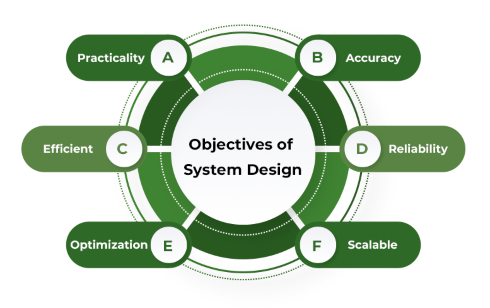

# What is System Design?

`System Design` is the process of defining the architecture, components, modules, interfaces, and data for a system to satisfy specified requirements. It involves translating user requirements into a detailed blueprint that guides the implementation phase.

## Why Learn System Design?

- In any development process, be it Software or any other tech, the most important stage is Design. Without the designing phase, you cannot jump to the implementation or the testing part.

- `System Design` is a vital step in the development of a system but also provides the backbone to handle exceptional scenarios because it represents the business logic of the software.


## Objectives of System Design



1. **Practicality**: We need a system that should be targetting the (users) corresponding to which they are designing.

2. **Accuracy**: System design should be designed in such a way it fulfills nearly all requirements around which it is designed.

3. **Efficient**: The system design should make good use of resources, avoiding waste that increases costs and preventing underuse of resources that can lead to inefficiencies.

4. **Reliability**: The system designed should be in proximity to a failure-free environment for a certain period of time.

5. **Optimization**: Time and space should be optimized.

6. **Scalability**: System design should be adaptable with time as per different user needs of customers which we know will keep on changing on time.


## Advantages of System Design

- **Reduces the Design Cost of a Product**: Using established design patterns and reusable components, teams can lower the effort and expense.

- **Speedy Software Development Process**: Using frameworks and libraries accelerates development.

- **Increases Efficiency and Consistency**: Familiar tools and methodologies enable programmers to work more effectively, reducing the likelihood of errors.

- **Saves Resources**: Optimized workflows and shared resources minimize the need for redundant efforts, thereby conserving both human and material resources.


## How To: System Design?

```
[1] Understand the Problem
      |
      v
[2] Define Requirements & Scope
      |
      v
[3] Research Existing Solutions
      |
      v
[4] Create High-Level Design (HLD)
      |
      v
[5] Break Down into Low-Level Design (LLD)
      |
      v
[6] Document Thoroughly
      |
      v
[7] Review, Iterate, and Optimize
```