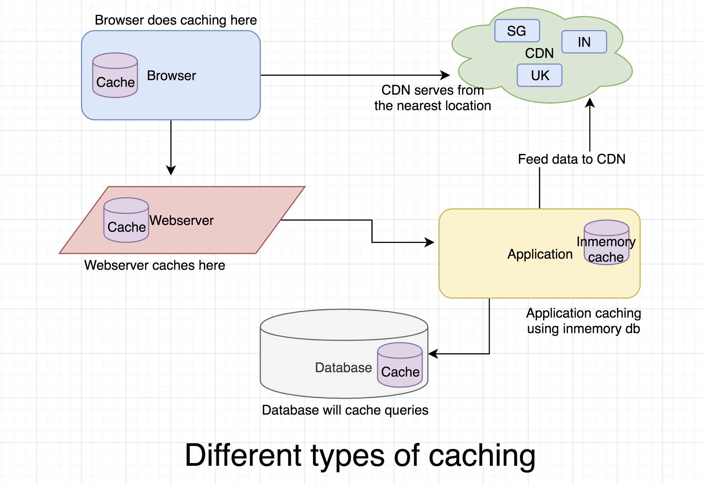

# Types of Caching

## Definition

**Caching** is the technique of storing frequently accessed data in a **fast, temporary storage layer** (cache) so that future requests can be served quickly without repeatedly querying the database or remote service.

Caching improves **performance, scalability, and response time** in modern distributed systems by reducing load on backend components.

---

## Why Caching Is Needed

* **Reduce Latency:** Serve data in milliseconds from memory instead of slow disk or network.

* **Reduce Server Load:** Offload repeated, expensive operations.

* **Improve Scalability:** Handle more traffic without increasing backend capacity.

* **Enhance User Experience:** Faster page loads and smoother interactions.

* **Lower Costs:** Minimize compute and DB read charges (especially in cloud environments).

---

## Key Caching Concepts

* **Cache Hit** → Data found in cache (fast).

* **Cache Miss** → Data not in cache (requires DB/API fetch).

* **TTL (Time-To-Live)** → Expiration time of cached data.

* **Cache Eviction** → Old entries removed when cache is full or expired.

* **Warm Cache** → Cache that already contains commonly used data.

* **Cold Cache** → Fresh cache with no entries.

---

## Types of Caching

Below are the major types of caching used in system design.
Each type solves a specific performance problem.

---

## 1. Client-Side Caching

Client-side caching stores data **on the user’s browser or device**.

The browser caches static resources such as:

* HTML
* CSS
* JavaScript
* Images, videos
* API responses (using Service Workers)

### Key Uses

* Reduce load time for repeat visits.
* Reduce network calls.
* Improve offline capabilities (PWA).

### When to Use

* Serving static assets.
* Optimizing front-end performance.
* Offline-ready applications.

---

## 2. Server-Side Caching

Server-side caching stores cached data **on the application server memory**.

Examples:

* In-memory objects
* Local session storage
* Framework-level caches (Django, Spring, Express)

### Key Uses

* Caching frequent DB queries.
* Temporary data storage for requests.
* Reducing computation overhead.

### When to Use

* Applications with moderate traffic.
* Single-server deployments.
* Caching small datasets like session data.

---

## 3. Distributed Caching

A **distributed cache** is a centralized caching layer shared across multiple application servers.

Examples:

* **Redis**
* **Memcached**
* **Hazelcast**

### Key Uses

* Store shared session data.
* Cache DB results at scale.
* Rate limiting, leaderboards, pub/sub.

### When to Use

* Large-scale systems.
* Microservices.
* Cache-aside or read-through strategies.

---

## 4. CDN Caching (Edge Caching)

A **Content Delivery Network (CDN)** caches static content at **edge servers near users worldwide**.

Examples:

* Cloudflare
* AWS CloudFront
* Akamai

### Key Uses

* Caching static files (images, CSS, JS)
* Video streaming
* Global scalability

### When to Use

* Applications with global traffic.
* Websites with heavy static content.
* Reducing load on origin servers.

---

## 5. Database Caching

Stores DB results or computation outputs so the database doesn’t run expensive queries repeatedly.

Forms include:

* Query caching
* Index caching
* Materialized views
* Read replicas

### Key Uses

* Speed up heavy queries.
* Reduce DB CPU usage.
* Improve performance during spikes.

### **When to Use**

* Analytical workloads.
* Read-heavy applications.
* Expensive joins/aggregations.

---

## 6. Application-Level Caching (Cache-Aside)

The application manages caching logic explicitly:

1. Check cache
2. If miss → fetch from DB
3. Store result in cache
4. Return data

This is the **most widely used** approach in system design.

### Key Uses

* Fine-grained caching control.
* Storing frequently read data (profiles, product pages)
* Dynamic content caching.

### When to Use

* Complex domains where caching varies per endpoint.
* High-performance API backends.

---

## 7. OS-Level / Kernel Caching

Operating systems automatically cache:

* Disk blocks
* File system metadata
* Recently accessed files

### Key Uses

* Speeding up file reads.
* Reducing disk I/O cost.

### When to Use

* High-throughput file servers.
* Data processing systems.

---

## 8. Hardware Caching

Caching built into hardware components:

* **CPU cache (L1/L2/L3)**
* **GPU cache**
* **SSD cache**

### Key Uses

* Speeding up CPU/GPU operations.
* Reducing memory access time.

### When to Use

* Low-level compute-heavy operations.
* High-performance workloads (gaming, HPC).

---

## Comparison Table

| **Aspect**      | **Client-Side** | **Server-Side**      | **Distributed**           | **CDN**        | **Database Cache** | **App-Level**  |
| --------------- | --------------- | -------------------- | ------------------------- | -------------- | ------------------ | -------------- |
| **Location**    | Browser/device  | App server           | Cache cluster             | Edge servers   | DB layer           | App logic      |
| **Best For**    | Static files    | Small data, sessions | Large-scale, shared cache | Global traffic | Heavy queries      | Custom caching |
| **Speed**       | Fast            | Very fast            | Fast                      | Fast           | Medium             | Fast           |
| **Scalability** | Limited         | Low                  | High                      | Global         | Medium             | High           |
| **Consistency** | Low             | Medium               | Tunable                   | Medium         | High               | Tunable        |

---

## Popular Caching Tools

### **Redis**

* Distributed, in-memory
* Pub/sub, streams, geo queries
* Most popular caching technology

### **Memcached**

* Ultra-fast key-value store
* Simple caching use cases

### **Cloudflare / CloudFront**

* Edge caching for static and dynamic content

### **Varnish**

* HTTP accelerator
* Used by high-traffic websites

---

## Summary

* **Client-side caching** → Fastest way to reduce repeated downloads.

* **Server-side caching** → Good for single-server performance boosts.

* **Distributed caching (Redis/Memcached)** → Best for scalable backend systems.

* **CDN caching** → Global delivery with minimal latency.

* **Database caching** → Improves DB read performance.

* **Application-level caching** → Most flexible and widely used in system design.

> Caching is one of the fundamental building blocks of scalable system design.
> It trades **memory** for **speed** — making systems faster, cheaper, and more reliable.

---
