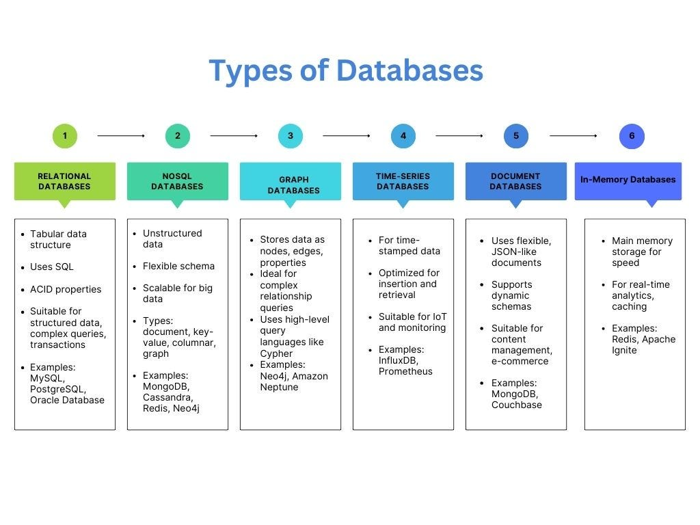

# Database Types

## Overview

In system design, the choice of database is crucial — it impacts **scalability, consistency, latency, and overall architecture**.
Databases are broadly classified into two categories:

1. **Relational Databases (SQL)**
2. **Non-Relational Databases (NoSQL)**

Each type serves different data models, access patterns, and scaling requirements.

---
## Types of Databases

---

## 1. Relational Databases (SQL)

### Definition

* Store data in **tables** (rows and columns) with **predefined schema**.
* Based on **relational algebra** and **ACID transactions** (Atomicity, Consistency, Isolation, Durability).
* Suitable for applications requiring **data integrity**, **complex queries**, and **relationships**.

---

### Architecture

* **Tables**: Core data structure with columns (fields) and rows (records).
* **Primary Key**: Unique identifier for each record.
* **Foreign Key**: Creates relationships between tables.
* **Indexes**: Speed up query performance by pre-sorting or hashing data.

---

### Characteristics

| **Property**          | **Description**                                                |
| --------------------- | -------------------------------------------------------------- |
| **Schema**            | Rigid, predefined schema. Any change requires migrations.      |
| **Consistency Model** | Strong consistency by default (ACID).                          |
| **Query Language**    | SQL (Structured Query Language).                               |
| **Transactions**      | Multi-step transactions supported.                             |
| **Scalability**       | Vertical scaling (Scale-Up) — limited by hardware.             |
| **Joins**             | Fully supported (JOIN, UNION, etc.).                           |
| **Use Case**          | Banking systems, ERP, e-commerce, where correctness > latency. |

---

### Advantages

* Enforces **data integrity** and **relationships**.
* Supports **complex queries and aggregations**.
* **Transactional safety** ensures data reliability.

### Limitations

* **Rigid schema** — hard to adapt for dynamic data.
* **Poor horizontal scalability** (hard to shard).
* Performance drops with **large-scale unstructured data**.

---

### Popular Examples

* **MySQL**
* **PostgreSQL**
* **Oracle**
* **Microsoft SQL Server**

---

## 2. Non-Relational Databases (NoSQL)

### **Definition**

* Designed to handle **massive, distributed, unstructured or semi-structured data**.
* Often **schema-less**, enabling **flexibility and horizontal scaling**.
* Prioritize **availability and partition tolerance** (from CAP theorem).
* Typically follow **BASE** principles:

  * **Basically Available**, **Soft state**, **Eventual consistency**.

---

### Core Characteristics

| **Property**     | **Description**                                   |
| ---------------- | ------------------------------------------------- |
| **Schema**       | Dynamic / Flexible schema                         |
| **Scalability**  | Horizontal (Scale-Out)                            |
| **Consistency**  | Eventual (some support tunable consistency)       |
| **Query Model**  | Depends on type (Key-based, Document-based, etc.) |
| **Performance**  | Optimized for high write/read throughput          |
| **Transactions** | Limited or per-document transactions              |

---

### NoSQL Database Models

---

### a. Key-Value Stores

**Concept:**
Data is stored as a collection of **key-value pairs**, similar to a hash map.
Ideal for **fast lookups** and **low-latency operations**.

**Examples:**

* **Redis** – in-memory, supports caching and pub/sub.
* **Amazon DynamoDB** – serverless, auto-scaled key-value store.
* **Riak**, **Aerospike**

**Use Cases:**

* Caching user sessions
* Leaderboards, counters
* Real-time analytics

**Advantages:**

* Blazing fast (O(1) access).
* Simple and horizontally scalable.

**Drawbacks:**

* No relationships or secondary indexes.
* Querying limited to primary keys only.

---

### b. Document Stores

**Concept:**
Stores data as **documents** (JSON, BSON, or XML).
Each document contains all related data — ideal for **semi-structured** or **hierarchical** data.

**Examples:**

* **MongoDB**
* **CouchDB**
* **Elasticsearch** (document search engine)

**Use Cases:**

* User profiles, product catalogs, CMS systems.
* Applications needing flexible schema per record.

**Advantages:**

* Schema-less — easy to evolve data structure.
* Rich query and indexing capabilities.
* Scales horizontally using sharding.

**Drawbacks:**

* Complex joins are difficult or inefficient.
* Large documents can cause performance issues.

---

### c. Wide-Column Stores

**Concept:**
Data is stored in **tables**, but each row can have **different columns**.
Ideal for **time-series**, **IoT**, and **big data** workloads.

**Examples:**

* **Apache Cassandra**
* **HBase (Hadoop ecosystem)**
* **Google Bigtable**

**Use Cases:**

* Time-series metrics (e.g., CPU logs)
* Real-time analytics
* IoT sensor data

**Advantages:**

* High write throughput.
* Linear horizontal scalability.
* Fault-tolerant via replication.

**Drawbacks:**

* Complex data modeling.
* Limited ad-hoc query support.

---

### d. Graph Databases

**Concept:**
Data is represented as **nodes (entities)** and **edges (relationships)**.
Each edge has properties describing the **relationship type and weight**.
Optimized for traversing complex networks.

**Examples:**

* **Neo4j**
* **Amazon Neptune**
* **ArangoDB**

**Use Cases:**

* Social networks
* Fraud detection
* Recommendation systems

**Advantages:**

* Extremely fast relationship traversal.
* Query language like **Cypher** allows intuitive pattern queries.

**Drawbacks:**

* Not ideal for analytical workloads.
* Difficult to scale horizontally.

---

## SQL vs NoSQL — Detailed Comparison

| **Aspect**         | **SQL Databases**         | **NoSQL Databases**                           |
| ------------------ | ------------------------- | --------------------------------------------- |
| **Data Model**     | Tables with fixed schema  | Flexible (Key-Value, Document, Column, Graph) |
| **Schema**         | Rigid, predefined         | Dynamic / schema-less                         |
| **Transactions**   | ACID compliant            | BASE (eventual consistency)                   |
| **Consistency**    | Strong                    | Tunable or Eventual                           |
| **Scalability**    | Vertical (Scale-Up)       | Horizontal (Scale-Out)                        |
| **Joins**          | Supported                 | Generally not supported                       |
| **Query Language** | SQL                       | Varies (JSON-based, APIs)                     |
| **Best For**       | OLTP, structured data     | Big Data, high scalability                    |
| **Examples**       | MySQL, PostgreSQL, Oracle | MongoDB, Redis, Cassandra, Neo4j              |

---

## Choosing the Right Database

| **Requirement**                    | **Recommended Type** | **Example**          |
| ---------------------------------- | -------------------- | -------------------- |
| Complex transactions, consistency  | Relational (SQL)     | PostgreSQL, MySQL    |
| Real-time caching                  | Key-Value Store      | Redis                |
| Flexible schema, JSON data         | Document Store       | MongoDB              |
| High write throughput, time-series | Wide Column Store    | Cassandra            |
| Relationship-heavy data            | Graph Database       | Neo4j                |
| Event data stream storage          | Log-based            | Kafka, ElasticSearch |

---

## Polyglot Persistence

In modern systems, **no single database fits all use cases**.
**Polyglot persistence** means using **multiple types of databases** in one system — each for what it does best.

**Example:**

* Use **PostgreSQL** for transactions
* Use **Redis** for caching
* Use **Elasticsearch** for search
* Use **MongoDB** for analytics

This approach improves scalability and flexibility.

---
