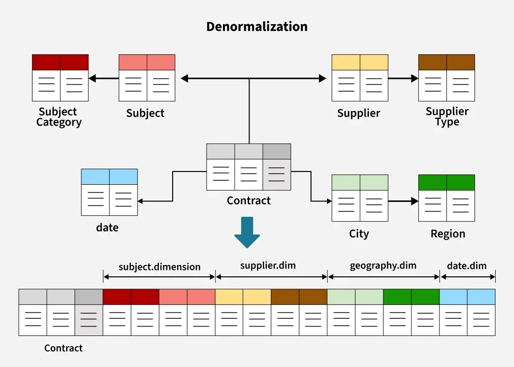

# Database Denormalization for Performance

## Definition

* **Denormalization** is the process of **intentionally introducing redundancy into a database schema** to improve **read performance** and reduce the need for complex `JOIN` operations.

* It is the **opposite of normalization**, where data is split into multiple tables to eliminate redundancy and maintain consistency.



---

## Why Denormalization is Needed

* In large-scale systems, **read queries** often outnumber writes by a large margin (e.g., 90% reads vs 10% writes).

* **Normalized databases** require multiple joins for complex reads, which can degrade performance under high traffic.

* **Denormalization** reduces query complexity and the number of joins — improving **response time** and **throughput**.

---

## Normalization vs Denormalization

| **Aspect**            | **Normalization**               | **Denormalization**                                    |
| --------------------- | ------------------------------- | ------------------------------------------------------ |
| **Goal**              | Eliminate redundancy            | Improve read performance                               |
| **Data Storage**      | Minimal redundancy              | Intentional redundancy                                 |
| **Query Performance** | Slower (due to joins)           | Faster (less joins)                                    |
| **Write Performance** | Fast updates (less duplication) | Slower (need to update multiple places)                |
| **Data Consistency**  | Easier to maintain              | Harder to maintain                                     |
| **Use Case**          | OLTP systems (e.g., banking)    | OLAP, read-heavy systems (e.g., analytics, e-commerce) |

---

## When to Use Denormalization

Use denormalization **only when performance gains outweigh consistency costs**, such as:

* When the system is **read-heavy** (e.g., dashboards, analytics, news feeds).
* When join operations are **expensive or frequent**.
* When **pre-aggregated or pre-computed data** can save time (e.g., materialized views).
* When scaling **horizontally** with **sharding**, and joins across shards are impractical.

---

## Common Denormalization Techniques

### 1. Duplicate Data Across Tables

* Store frequently accessed data in multiple tables.
* **Example:** Storing a user’s `username` and `email` in the `orders` table to avoid joining `users` and `orders`.

```sql
-- Normalized
SELECT users.username, orders.amount
FROM users
JOIN orders ON users.id = orders.user_id;

-- Denormalized
SELECT username, amount FROM orders;
```

* **Benefit:** Speeds up query performance.

* **Trade-off:** Updates to `username` must be propagated manually.

---

### 2. Precomputed / Aggregate Tables

* Store **precomputed aggregates** (e.g., total sales, average ratings) instead of recalculating on every query.
* **Example:**

  * Instead of joining `orders` each time to calculate total sales, keep a summary table.

| date       | total_sales |
| ---------- | ----------- |
| 2025-11-07 | $125,000    |

* **Benefit:** Reduces load on main tables.
* **Trade-off:** Slightly stale data (eventual consistency).

---

### 3. Materialized Views

* Database-managed **cached results of a query**, updated periodically or on-demand.

* **Example:**

  ```sql
  CREATE MATERIALIZED VIEW daily_sales AS
  SELECT date, SUM(amount) AS total_sales
  FROM orders
  GROUP BY date;
  ```

* **Benefit:** Querying the view is faster than recalculating joins.

* **Trade-off:** Needs manual refresh or triggers.

---

### 4. JSON / Embedded Documents (in NoSQL)

* Store related information together in **nested or embedded structures**.
* **Example:** In MongoDB, store user and order details in one document:

  ```json
  {
    "order_id": 123,
    "user": {
      "id": 42,
      "name": "Alice"
    },
    "items": ["Laptop", "Mouse"]
  }
  ```
* **Benefit:** No joins; data retrieved in one query.

* **Trade-off:** Updates become heavier if repeated data exists.

---

### 5. Caching / Pre-Fetch Tables

* Create **denormalized cache tables** optimized for specific queries.
* Example: A “user_feed” table containing precomputed post data, instead of joining posts, likes, and comments every time.

---

## Advantages

- **Faster Reads:** Reduces joins and complex queries.

- **Better Query Performance:** Especially for aggregated and analytical queries.

- **Simplified Query Logic:** Easier to query data from a single table.

- **Scalable:** Works well with distributed databases where joins are costly.

---

## Disadvantages

- **Data Redundancy:** Increases storage usage.

- **Data Inconsistency:** Updates must propagate to all copies of data.

- **Complex Writes:** Multiple updates required for a single change.

- **Maintenance Overhead:** Harder to ensure integrity and synchronization.

---

## Best Practices

* Use **denormalization selectively** — only where needed.

* Automate synchronization using **triggers, jobs, or change data capture (CDC)**.

* Monitor and manage **redundant fields**.

* Combine with **caching** and **indexing** for best results.

* Use **materialized views** for complex aggregations instead of full denormalization.

---

## Summary Table

| **Technique**      | **Goal**                           | **Benefits**        | **Trade-Offs**   |
| ------------------ | ---------------------------------- | ------------------- | ---------------- |
| Duplicate Data     | Avoid joins                        | Faster reads        | Harder updates   |
| Precomputed Tables | Speed up aggregates                | Efficient analytics | Stale data       |
| Materialized Views | Cache query results                | High performance    | Requires refresh |
| Embedded Documents | Reduce joins (NoSQL)               | One-query fetch     | Redundant data   |
| Cache Tables       | Quick reads for specific use cases | High throughput     | Sync complexity  |

---
