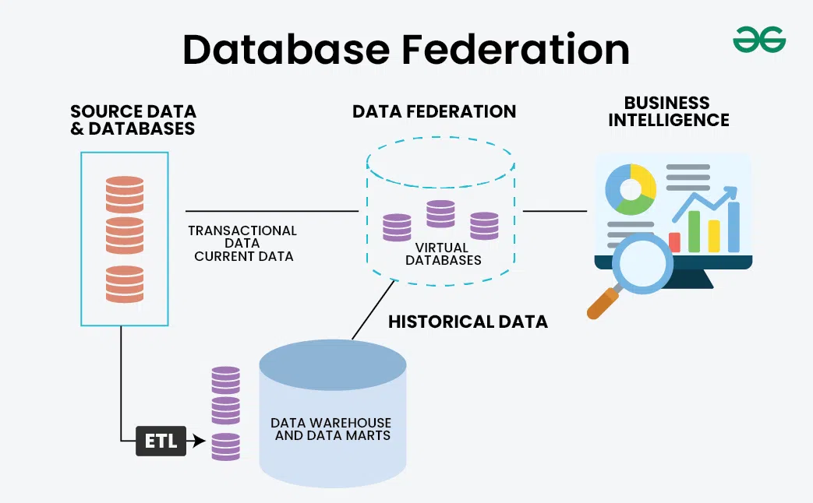

# Database Federation

## Definition

* **Database Federation** (also called **Federated Database Architecture**) is a technique where **multiple independent databases** are combined under a **single logical view**, allowing users or applications to query them **as if they were one unified database**.

* Each participating database is **autonomous** — it maintains its own schema, data, and storage — but the federation layer **orchestrates queries and aggregates results** transparently.

---

## Key Idea

* Instead of merging all data into one giant monolithic database, federation allows **distributed databases to cooperate** while maintaining **independence**.
* It provides **a virtual database layer** that hides the complexity of underlying heterogeneous data sources.

---

## How Federation Works



1. **Application Query:**
   The client sends a single SQL query to the federated layer.

2. **Federation Layer / Query Engine:**
   Parses the query and determines which databases hold the required data.

3. **Query Distribution:**
   The query is split and sent to respective **data sources (DB1, DB2, etc.)**.

4. **Result Aggregation:**
   Each database executes its part and returns results to the federation layer, which merges them.

5. **Unified Response:**
   The final combined result is returned to the client as a single dataset.

---

## Example

Suppose you have:

* A **User Database** in MySQL.
* An **Orders Database** in PostgreSQL.

A federated query can look like this:

```sql
SELECT u.name, o.amount
FROM mysql.users AS u
JOIN postgres.orders AS o
ON u.id = o.user_id;
```

The **federation layer** (e.g., via middleware or a federated DB engine) will:

* Query MySQL for user data.
* Query PostgreSQL for order data.
* Join results and return a unified dataset.

---

## Benefits of Federation

| **Benefit**                   | **Description**                                                         |
| ----------------------------- | ----------------------------------------------------------------------- |
| **Single Access Point**       | Provides a unified interface to multiple databases.                     |
| **No Data Duplication**       | Data stays in original sources — avoids ETL or central data warehouses. |
| **Heterogeneous Integration** | Works across different DB types (SQL, NoSQL, cloud storage).            |
| **Autonomy**                  | Each database can evolve independently.                                 |
| **Faster Development**        | Developers can query multiple sources without deep knowledge of each.   |

---

## Challenges in Federation

| **Challenge**                 | **Description**                                                            |
| ----------------------------- | -------------------------------------------------------------------------- |
| **Performance Overhead**      | Cross-database joins are slower than local joins.                          |
| **Network Latency**           | Querying multiple sources increases response time.                         |
| **Consistency**               | Difficult to enforce ACID guarantees across systems.                       |
| **Query Optimization**        | Federated engines must plan queries efficiently across heterogeneous data. |
| **Security & Access Control** | Must manage different credentials and permissions per source.              |

---

## Use Cases

* **Data Virtualization:** Create a unified view across systems for analytics or reporting.

* **Hybrid Systems:** Combine on-prem and cloud databases seamlessly.

* **Microservices Architecture:** Each service owns its own database, but federation allows unified queries.

* **Multi-Tenant SaaS Systems:** Different tenants’ data stored across databases, queried centrally.

---

## Federation vs. Data Warehouse

| **Aspect**        | **Database Federation**          | **Data Warehouse**                    |
| ----------------- | -------------------------------- | ------------------------------------- |
| **Data Location** | Data remains in source systems   | Data copied into a central repository |
| **Freshness**     | Always up-to-date                | Depends on ETL schedule               |
| **Performance**   | Slower (real-time joins)         | Faster (pre-aggregated data)          |
| **Maintenance**   | Easier (no ETL)                  | Higher (data pipelines)               |
| **Use Case**      | Real-time queries across sources | Historical analytics and BI           |

---

## Common Federation Technologies

| **Technology**                     | **Description / Use Case**                                                                   |
| ---------------------------------- | -------------------------------------------------------------------------------------------- |
| **MySQL Federated Engine**         | Native MySQL feature that allows queries on remote MySQL servers.                            |
| **AWS Athena / Glue Data Catalog** | Query multiple data sources in AWS ecosystem.                                                |
| **Presto / Trino**                 | Distributed SQL query engines for federated analytics (supports MySQL, S3, Cassandra, etc.). |
| **Apache Drill**                   | Schema-free SQL query engine for federated querying across multiple systems.                 |
| **Google BigQuery Federation**     | Query external data sources (Cloud SQL, Sheets, etc.) without loading data.                  |

---

## Best Practices

* Use **federation for reads**, not for transactional writes.

* Combine with **caching** or **materialized views** to reduce query latency.

* Monitor performance — optimize cross-database queries with filters pushed down to source DBs.

* Secure connections and enforce consistent **access control** across data sources.

* Use **federated engines** (Presto, Trino, Drill) for large-scale analytical federation.

---

## Summary Table

| **Feature**       | **Federation**                    | **Sharding**                          | **Replication**           |
| ----------------- | --------------------------------- | ------------------------------------- | ------------------------- |
| **Goal**          | Unified query across multiple DBs | Distribute one DB’s data horizontally | Copy data for redundancy  |
| **Data Location** | Distributed, stays in place       | Distributed across shards             | Same data across nodes    |
| **Schema**        | Different per DB                  | Shared schema                         | Shared schema             |
| **Consistency**   | Best-effort                       | Managed per shard                     | Tunable (sync/async)      |
| **Performance**   | Lower (cross-source joins)        | High for isolated queries             | High for reads            |
| **Use Case**      | Multi-source querying             | Scaling large datasets                | High availability & reads |

---
