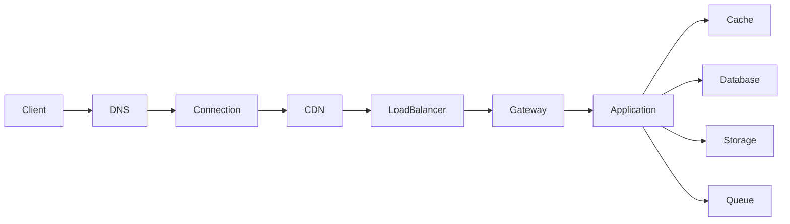
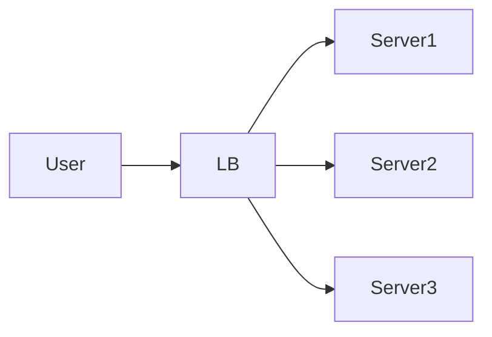
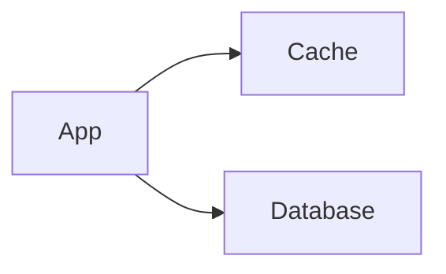

# A Real-World System Architecture

## 1. Problem Statement

Every distributed system must answer one fundamental question:

> **How does a request travel from a user to the backend and return as a response under scale, failures, and latency constraints?**

This architecture is not tied to any specific product.
It represents a **generalized blueprint** used by systems like APIs, web platforms, and large-scale services.

The system must ensure:

* Low latency for user-facing requests
* High availability across failures
* Horizontal scalability under traffic growth
* Secure communication across all layers
* Efficient resource utilization

---

## 2. High-Level Architecture



### Core Components

| Component     | Role                               |
| ------------- | ---------------------------------- |
| DNS           | Resolves domain to IP              |
| Connection    | Establishes TCP/TLS                |
| CDN           | Edge caching and latency reduction |
| Load Balancer | Traffic distribution               |
| Gateway       | Request control layer              |
| Application   | Business logic execution           |
| Data Layer    | Storage and retrieval              |
| Queue         | Async processing                   |

This diagram represents the **request path**, but each component introduces its own design challenges.

---

## 3. Request Lifecycle Overview

A request does not directly reach the application.

It passes through multiple layers, each solving a specific problem:

```
Client → DNS → Network → Edge → Routing → Application → Data → Response
```

Each step is intentionally placed to:

* Reduce latency
* Improve scalability
* Isolate failures
* Enforce security

---

## 4. Client Layer


User action example:

```text
GET https://api.example.com/users/123
```

Before leaving the client, browser/app may check:


| Cache Type        | What it stores                        |
|-------------------|---------------------------------------|
| HTTP cache        | Previously fetched HTTP responses     |
| DNS cache         | Recently resolved domain-to-IP maps   |
| Service worker    | Programmatic cache for PWA assets     |
| Keep-alive pool   | Reusable TCP connections              |

If any cache is valid, the corresponding network round-trip is skipped entirely. This is the cheapest optimization possible — work that never leaves the client.


---

## 5. DNS Resolution

The first network step is resolving the domain name into an IP address.

### Resolution Flow

```
Browser → OS → Recursive Resolver → Root → TLD → Authoritative
```

### Key Properties

* DNS responses are cached using TTL values
* Recursive resolvers perform the full lookup process
* Authoritative servers provide the final mapping

DNS is not just a lookup system.
It is also used for **traffic routing**, directing users to the nearest or healthiest region.

---

## 6. Connection Establishment

Before sending application data, a secure connection must be established.

### TCP Handshake

Ensures reliable communication between client and server.

### TLS Handshake


TCP establishes reliable transport:

```
Client                          Server
  │                               │
  │──── SYN ─────────────────────►│
  │◄─── SYN-ACK ──────────────────│
  │──── ACK ─────────────────────►│
  │    (connection established)   │
```

### Impact

* Introduces initial latency
* Optimized using connection reuse and session resumption

This stage ensures that all communication is both **reliable and secure**.

---

## 7. CDN and Edge Layer

The request is often routed through a CDN before reaching the backend.

### Responsibilities

* Serve cached static content
* Reduce latency by proximity
* Protect origin servers from spikes
* Handle TLS termination

### Behavior

* Cache Hit → Response returned immediately
* Cache Miss → Request forwarded to backend

CDNs significantly reduce load on backend systems and improve user experience.

---

## 8. Load Balancer

The load balancer distributes incoming traffic across multiple servers.

### Types

| Type | Operates at       | Routing basis                              |
|------|-------------------|--------------------------------------------|
| L4   | Transport (TCP)   | IP address and port only                   |
| L7   | Application (HTTP)| URL path, Host header, cookies, body content |

### Why it is required

Without load balancing:

* Some servers become overloaded
* Others remain underutilized
* System reliability decreases

### Responsibilities

* Distribute traffic evenly
* Perform health checks
* Remove unhealthy instances
* Support failover



This enables horizontal scaling and fault tolerance.

---

## 9. API Gateway / Reverse Proxy

This layer acts as the **controlled entry point** into the system.

### Responsibilities

* Authentication and authorization
* Rate limiting
* Request validation
* Routing to appropriate services

This layer ensures that invalid or malicious requests do not reach application logic.

It also centralizes cross-cutting concerns, improving maintainability.

---

## 10. Application Layer

This layer executes the core business logic.

### Characteristics

* Stateless design
* Horizontally scalable
* Independent of infrastructure

### Responsibilities

* Process incoming requests
* Coordinate with internal services
* Interact with data layer

Stateless design ensures that instances can be added or removed without affecting system behavior.

---

## 11. Internal Service Communication

In complex systems, a single request may trigger multiple internal calls.

### Communication styles

* REST for simplicity
* gRPC for performance
* Messaging for decoupled workflows

### Challenges

* Partial failures
* Increased latency
* Service dependencies

### Required safeguards

* Timeouts to prevent blocking
* Retries for transient failures
* Circuit breakers to avoid cascading failures

This layer introduces complexity and requires careful design.

---

## 12. Data Layer

The data layer consists of multiple specialized systems.

### Components

| Component      | Purpose                             |
| -------------- | ----------------------------------- |
| Cache          | Fast access to frequently used data |
| Database       | Persistent storage                  |
| Object Storage | Large files                         |
| Queue          | Async processing                    |

### Access Pattern



The system typically checks the cache first.
If data is not found, it queries the database and updates the cache.

This pattern reduces database load and improves performance.

---

## 13. Async Processing

Some operations should not block the main request.

### Examples

* Sending emails
* Logging
* Media processing
* Analytics

### Flow


### Benefits

* Reduced response time
* Better scalability
* Improved failure isolation

Async processing is critical for high-throughput systems.

---

## 14. Response Flow

Once processing is complete, the response flows back:

```
Application → Gateway → Load Balancer → CDN → Client
```

The CDN may cache the response.
The client may also cache it for future requests.

---

## 15. Failure Handling

Failures are inevitable in distributed systems.

### Example failure chain

```
Slow database → thread blocking → request timeouts → retry storm → system outage
```

### Mitigation strategies

* Retries with exponential backoff
* Circuit breakers to stop repeated failures
* Graceful degradation
* Isolation of critical components

A well-designed system prevents failures from spreading across layers.

---

## 16. Security Considerations

Security must be enforced across all layers.

### Key controls

* TLS for encrypted communication
* Authentication at gateway
* Authorization using roles or policies
* Data encryption at rest and in transit
* Rate limiting to prevent abuse

Security is not a single feature.
It is a system-wide design requirement.

---

## 17. Observability

To operate a system at scale, visibility is essential.

### Core pillars

* Metrics (latency, errors, throughput)
* Logs (detailed event records)
* Traces (request journey across services)

### Key metrics

* Request rate
* Error rate
* Latency (p95, p99)
* Resource utilization

Observability enables debugging, scaling, and reliability improvements.

---

## 18. Scaling Strategy

Scaling must follow real bottlenecks.

**1. Introduce caching**

**2. Scale stateless services**

**3. Add async processing**

**4. Optimize database queries**

**5. Add replication and sharding**

**6. Expand to multiple regions**

Each step increases system complexity and must be justified by load.

---

## Conclusion

A real-world system is not defined by its components, but by how those components interact.

A well-designed architecture ensures:

* Efficient request handling
* Controlled failure propagation
* Predictable scaling behavior
* Strong security guarantees

Understanding this flow allows you to design systems across any domain.

---
