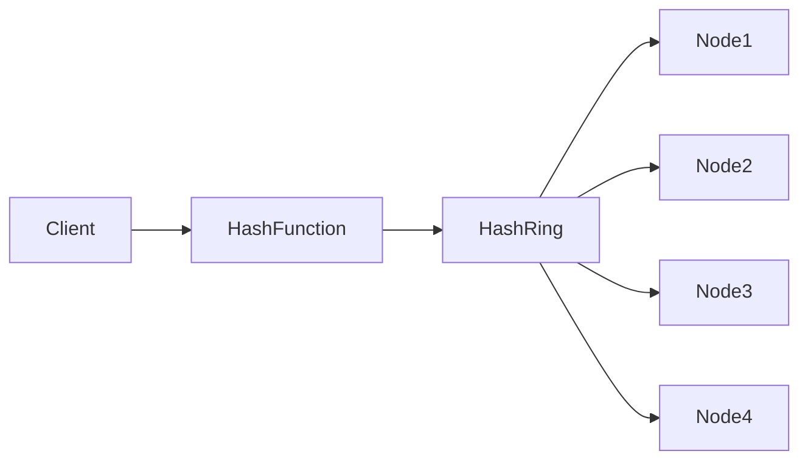
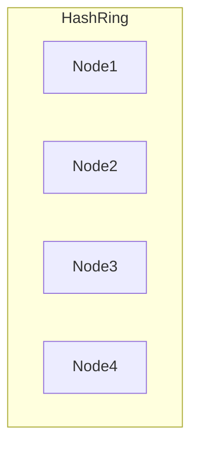
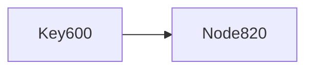
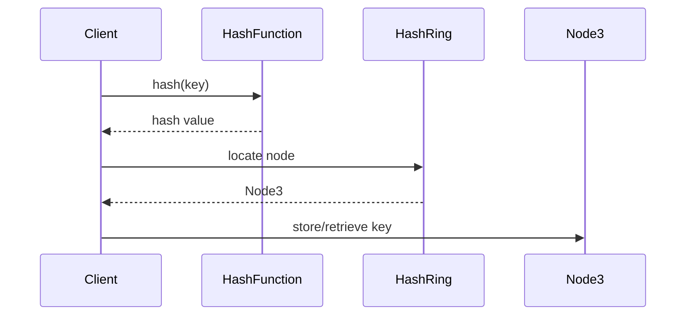

# Design Consistent Hashing

## 1. Problem Statement

**Consistent Hashing** is a distributed hashing technique used to efficiently distribute data across multiple servers while minimizing data movement when servers are added or removed.

Traditional hashing approaches often lead to large-scale data redistribution when the number of servers changes. 

Consistent hashing solves this issue by ensuring that **only a small portion of keys need to be reassigned**.

This technique is widely used in distributed systems such as:

* distributed caches
* distributed databases
* load balancers
* distributed storage systems

Real-world systems using consistent hashing include **Amazon Web Services Dynamo-style databases**, **Apache Cassandra**, and **Redis clusters**.

---

## 2. Functional Requirements

### Core Features

A consistent hashing system must support:

* Distribute keys across multiple servers
* Ensure minimal data movement when nodes join or leave
* Support horizontal scalability
* Provide balanced load distribution
* Handle node failures gracefully

---

### Example

Assume we want to store user sessions across multiple cache servers.

```
Key: user_123_session
```

The system must determine **which server stores this key**.

Example output:

```
user_123_session → CacheServer3
```

---

## 3. Non-Functional Requirements

| Requirement           | Description                                               |
| --------------------- | --------------------------------------------------------- |
| Scalability           | System must scale to thousands of nodes                   |
| Minimal Data Movement | Only a small subset of keys should move when nodes change |
| Load Balancing        | Keys should distribute evenly                             |
| Fault Tolerance       | System must continue working if nodes fail                |
| Low Latency           | Key lookup must be extremely fast                         |

---

### Expected Scale

Assume:

* **1 Billion keys**
* **100 cache nodes**
* **Millions of requests per second**

Key lookup operations must occur in **O(log N)** time or better.

---

## 4. Back-of-the-Envelope Estimation

Assume:

```
Total keys = 1 Billion
Servers = 100
```

Ideal distribution:

```
Keys per server ≈ 10 Million
```

Now consider adding a new node.

Traditional hashing would move:

```
≈ 1 Billion keys
```

With consistent hashing:

```
≈ 1/N of keys move
≈ 10 Million keys
```

This drastically reduces rebalancing cost.

---

## 5. High Level Architecture

Consistent hashing maps both **servers and keys** onto a logical ring.

Keys are assigned to the **nearest server clockwise on the ring**.



### Components

| Component     | Role                                     |
| ------------- | ---------------------------------------- |
| Client        | Generates keys for storage               |
| Hash Function | Converts keys and nodes into hash values |
| Hash Ring     | Logical ring representing hash space     |
| Nodes         | Servers storing data                     |

---

## 6. Core Components Deep Dive

### Hash Function

A deterministic hash function converts both **nodes and keys** into numeric values.

Example hash functions:

```
MD5
SHA-1
MurmurHash
```

Example:

```
hash("NodeA") → 135
hash("NodeB") → 490
hash("NodeC") → 820
```

Similarly:

```
hash("user_123") → 600
```

---

### Hash Ring

The hash space is represented as a circular structure.

Typical range:

```
0 → 2^32 - 1
```

Both **servers and keys are placed on this ring**.

---

### Nodes (Servers)

Each node is placed on the ring using its hash value.

Example nodes:

```
Node1
Node2
Node3
Node4
```

Each node is responsible for keys between itself and the previous node.

---

## 7. Data Model

In distributed caching systems, data is typically stored as **key-value pairs**.

Example table:

| Key               | Value        |
| ----------------- | ------------ |
| user_123_session  | session_data |
| product_567_cache | product_data |
| cart_789          | cart_items   |

Keys are mapped to servers via consistent hashing.

---

### Hash Ring Representation



Each node owns a segment of the ring.

---

## 8. API Design

Although consistent hashing is typically internal to systems, it can expose APIs.

### Locate Node for Key

```
GET /node/{key}
```

Example:

```
GET /node/user_123
```

Response:

```json
{
 "node": "Node3"
}
```

---

### Add Node

```
POST /node/add
```

Request:

```json
{
 "node": "Node5"
}
```

---

### Remove Node

```
DELETE /node/{nodeId}
```

---

## 9. Request Workflow

This flow describes how the system determines which node stores a particular key.

---

### Step 1 — Client Sends Key Request

A client wants to store or retrieve a key.

Example:

```
Key = user_123_session
```

---

### Step 2 — System Hashes the Key

The key is passed through a hash function.

```
hash(user_123_session) → 600
```

This determines the key's location on the hash ring.

---

### Step 3 — Locate Node on the Ring

The system moves **clockwise** on the ring until it finds the nearest node.



Example node positions:

```
Node1 → 135
Node2 → 490
Node3 → 820
Node4 → 950
```

Key hash:

```
600
```

Closest clockwise node:

```
Node3 (820)
```

Therefore:

```
user_123_session → Node3
```

---

### Step 4 — Store or Retrieve Data

The request is routed to the responsible node.


Node3 processes the request.

---

### Complete Lookup Sequence



---

## 10. Node Addition Flow

One of the main advantages of consistent hashing is minimal redistribution when nodes are added.

---

### Step 1 — New Node Joins

Example:

```
Node5 → hash value = 700
```

---

### Step 2 — Node Inserted in Ring


---

### Step 3 — Keys Reassigned

Only keys between **Node2 and Node5** move to the new node.

Example:

```
Keys in range (490 → 700)
```

These keys are reassigned to **Node5**.

---

### Result

Only a small subset of keys move.

```
≈ 1/N of total keys
```

---

## 11. Node Removal Flow

When a node fails or is removed, its keys are reassigned.

---

### Step 1 — Node Failure

Example:

```
Node3 removed
```

---

### Step 2 — Keys Move to Next Node


Keys previously owned by Node3 move to Node4.

---

### Step 3 — System Stabilization

Data is rebalanced among remaining nodes.

Only Node3's keys move.

---

## 12. Virtual Nodes (Important Improvement)

A problem with naive consistent hashing is **uneven distribution**.

To fix this, systems use **virtual nodes (vnodes)**.

Each physical server is represented by **multiple virtual nodes**.

Example:

```
Node1 → vnode1, vnode2, vnode3
Node2 → vnode4, vnode5, vnode6
```

---

### Virtual Node Hash Ring


Benefits:

* better load balancing
* smoother scaling
* reduced hotspots

---

## 13. Scaling the System

### Horizontal Scaling

Add more nodes to distribute load.

Consistent hashing ensures minimal redistribution.

---

### Replication

Data can be replicated across multiple nodes.

Example:

```
Primary Node
Next 2 nodes for replication
```

---

### Fault Tolerance

If a node fails:

* neighboring nodes handle traffic
* replicated data ensures availability

---

## 14. Bottlenecks and Solutions

| Problem                  | Solution              |
| ------------------------ | --------------------- |
| Uneven load distribution | Virtual nodes         |
| Node failures            | Replication           |
| Hot keys                 | Key replication       |
| Hash collisions          | Better hash functions |

---

## 15. Technology Stack

| Layer             | Technology       |
| ----------------- | ---------------- |
| Hashing           | MurmurHash / SHA |
| Distributed Cache | Redis Cluster    |
| Database          | Cassandra        |
| Monitoring        | Prometheus       |
| Orchestration     | Kubernetes       |

---

## Summary

Consistent hashing is a powerful technique for distributed systems that:

* distributes keys across nodes
* minimizes data movement during scaling
* supports horizontal scalability
* improves fault tolerance

By combining **hash rings**, **virtual nodes**, and **replication**, consistent hashing enables large-scale systems like distributed caches and databases to operate efficiently with thousands of nodes.

---