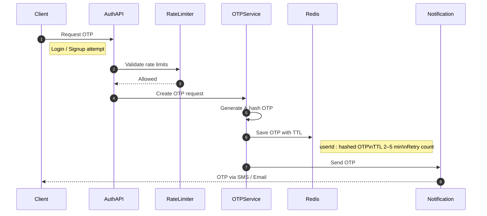
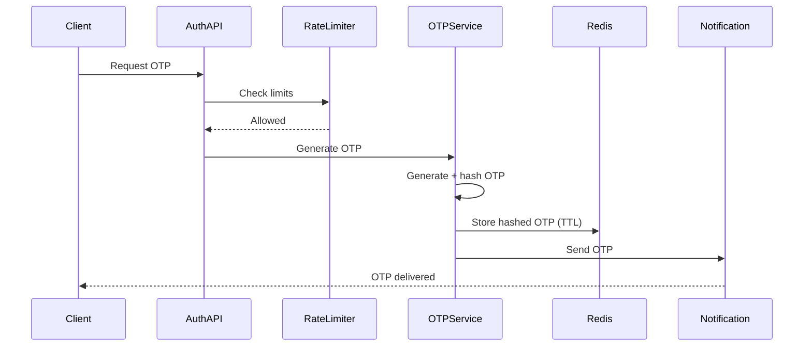
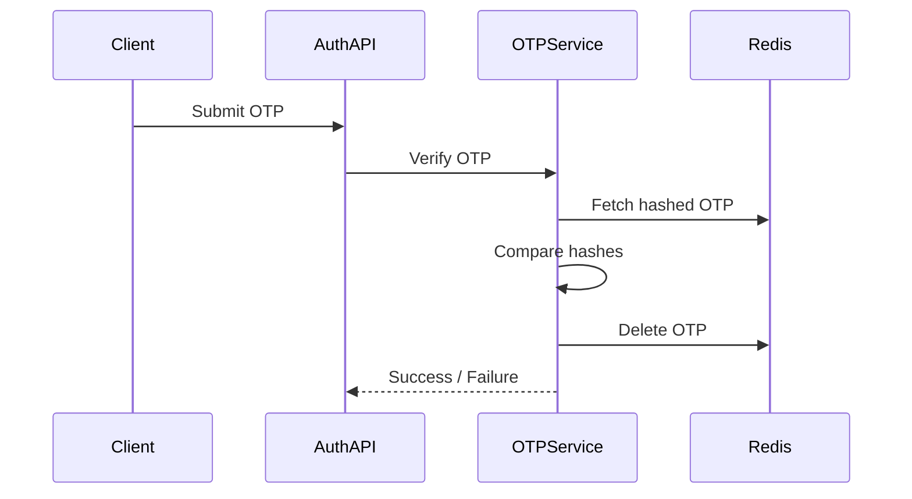

# OTP Service

## Introduction

OTP is often seen as a small feature, but in production systems it is a **critical security boundary**.

It protects login, password reset, and verification flows. A weak OTP design can enable brute-force attacks, account takeovers, or large-scale abuse.

From a system design point of view, OTP is about **controlled generation, temporary storage, strict validation, and abuse prevention**.

---

## High-Level Architecture

The OTP system is intentionally split into layers.
This separation keeps responsibilities clear and limits the blast radius of failures.

---

## Why This Structure?

* **Auth API** acts as the entry gate and enforces policies

* **OTP Service** focuses only on OTP logic

* **Redis** holds short-lived state with automatic expiry

* **Rate Limiter** prevents abuse before OTP generation

* **Notification Gateway** isolates unreliable external systems

This separation makes the system easier to secure and scale.

---

## OTP Request Flow (Generation)

The OTP request flow is designed to reject invalid or abusive requests as early as possible.

### Key Design Points

* Rate limiting happens **before OTP generation**

* OTP is generated using a secure random generator

* OTP is **hashed before storage**

* Redis TTL guarantees automatic expiry

* OTP delivery is decoupled from storage

---

## OTP Storage Design

OTP data is stored with strict constraints:

* Keyed by user identifier and purpose

* Value is **hashed OTP**, never plaintext

* TTL is short (usually 2–5 minutes)

* Retry / attempt count is stored alongside

Redis is chosen because OTPs are temporary and require fast reads and deletes.

---

## OTP Verification Flow

Verification is designed to guarantee **single-use correctness**.

### Verification Rules

* OTP comparison must be constant-time

* On success, OTP is **deleted immediately**

* On failure, attempt count is incremented

* OTP is invalidated after max attempts

Deletion ensures that even a valid OTP cannot be reused.

---

## Abuse Prevention Strategy

OTP endpoints are common targets for bots and brute-force attacks.
A good design enforces limits at multiple levels:

* OTP requests per user in a time window

* OTP requests per IP or device

* Verification attempts per OTP

These limits are enforced using Redis counters with expiry aligned to the OTP lifecycle.

---

## Failure Handling

Important failure cases and handling:

* **Notification failure**: allow resend or retry without creating a new OTP

* **Redis unavailable**: fail fast, do not generate OTP

* **Concurrent verification requests**: atomic read-and-delete ensures only one success

OTP must never exist without being stored, and must never be valid more than once.

---

## Scaling Considerations

* OTP Service is stateless and horizontally scalable

* Redis is the shared temporary state

* Notification providers are the primary bottleneck

* Async sending and provider fallback improve resilience

---

## Security Guarantees

A correct OTP system guarantees:

* OTPs are hashed at rest

* OTPs expire automatically

* OTPs are single-use

* Attempts are strictly limited

* OTP values are never logged

---

## Conclusion

OTP is not a helper feature.
It is a **security-critical system boundary**.

A good OTP design is simple in flow, strict in rules, and defensive by default. When this layer is strong, every authentication flow built on top of it becomes safer and easier to reason about.

---
