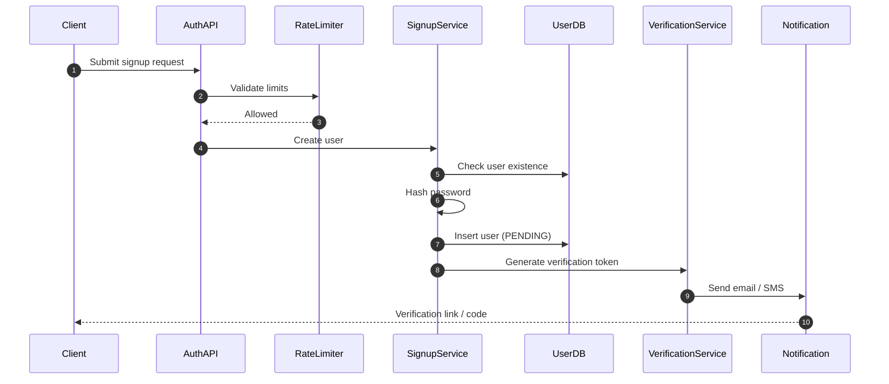

# Signup System

## Introduction

Signup is the **first real interaction** a user has with a system.

If it feels unreliable, slow, or unsafe, users lose trust before they even begin using the product.

From a system design perspective, signup is not just about inserting a row into a database. It is about **correctness under concurrency, secure credential handling, verification, and abuse prevention**.

---

## High-Level Architecture

The signup system is split into clear layers to separate responsibilities and reduce coupling.

---

## Why This Structure?

* **Auth API** validates input and enforces system-wide policies

* **Signup Service** owns user creation logic

* **User DB** enforces uniqueness and persistence guarantees

* **Verification Service** handles token lifecycle

* **Notification layer** isolates external delivery systems

This separation ensures failures in one layer do not corrupt user state.

---

## Signup Request Flow

**When a user submits signup data**:

* The request reaches the **Auth API**

* Input validation and rate limiting are applied

* The request is forwarded to the **Signup Service**

**The Signup Service then**:

* Checks whether the user already exists

* Hashes the password securely

* Creates a new user record in a **pending state**

* Triggers verification token generation

Signup must be treated as a controlled workflow, not a single database write.

---

## User Existence and Concurrency

A common failure case is **two signup requests for the same email or phone** arriving at the same time.

**To guarantee correctness**:

* Application-level checks are not sufficient

* The database must enforce a **unique constraint** on identifiers

**If two requests race**:

* One insert succeeds

* The other fails at the database level

* The system returns a clear “user already exists” response

This guarantees correctness even under concurrency.

---

## Password Storage Strategy

Passwords are never stored directly.

Key design rules:

* Passwords are hashed using a strong algorithm (bcrypt, Argon2)

* Each password uses a unique salt

* Plaintext passwords are never logged or persisted

Password hashing happens **before** writing to the database.

---

## Verification Strategy

Most systems do not activate accounts immediately.

**Instead**:

* Users are created in a **PENDING** state

* Email or phone ownership must be verified

* Only verified users become **ACTIVE**

**Verification tokens must be**:

* Random and unguessable

* Time-bound

* Single-use

If notification delivery fails, the user record is not deleted. The system allows resending verification without creating duplicate users.

---

## Abuse Prevention

Signup endpoints are common targets for bots.

A proper design includes:

* Rate limiting per IP and identifier

* CAPTCHA or challenge mechanisms

* Cooldown after repeated attempts

These checks belong at the **API layer**, not inside business logic.

---

## Failure Handling

Important failure scenarios:

* **Database unavailable**: fail fast, do not partially create users

* **Notification failure**: keep user in pending state, allow retry

* **Token generation failure**: user must not become active

From the user’s perspective, signup must be **atomic**: either the account is created safely, or it is not created at all.

---

## Scaling Considerations

* Signup service is stateless and horizontally scalable

* Database enforces consistency and uniqueness

* Notification systems are the main bottleneck

* Async delivery improves reliability and throughput

---

## Security Guarantees

A correct signup system guarantees:

* Unique user identifiers

* Secure password storage

* Explicit user state transitions

* Verification before activation

* Abuse controls at entry points

---

## Conclusion

Signup is not a form handler.
It is a **distributed workflow** involving validation, persistence, verification, and security controls.

When signup is designed well, every authentication flow built on top of it becomes more reliable.

---
