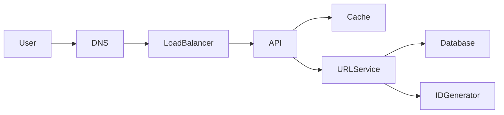
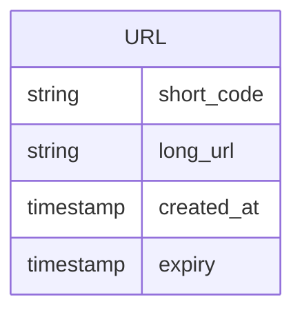
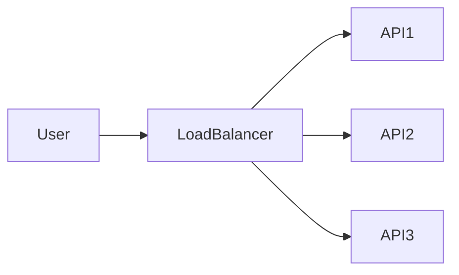
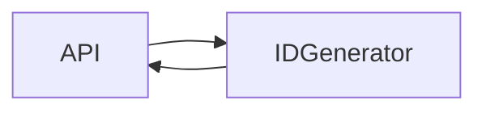
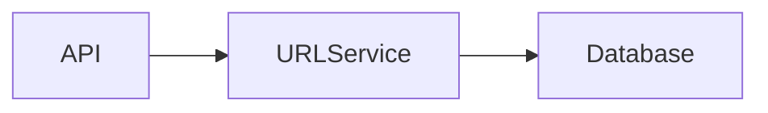
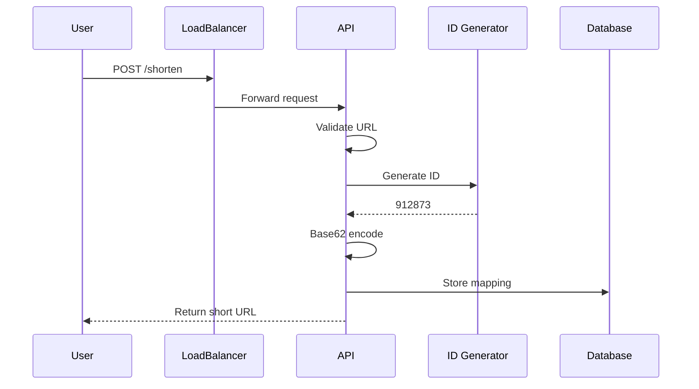
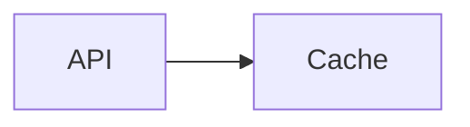
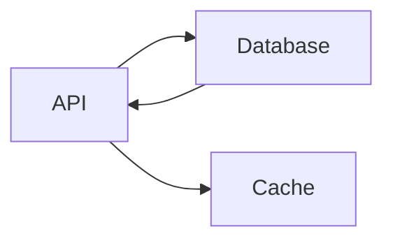
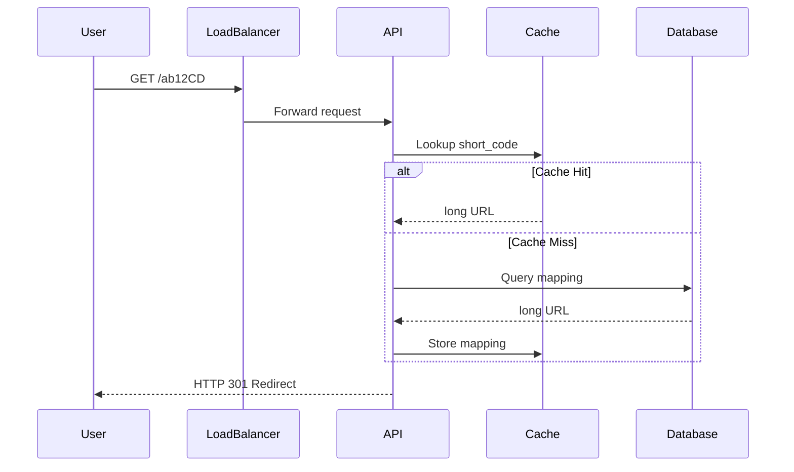
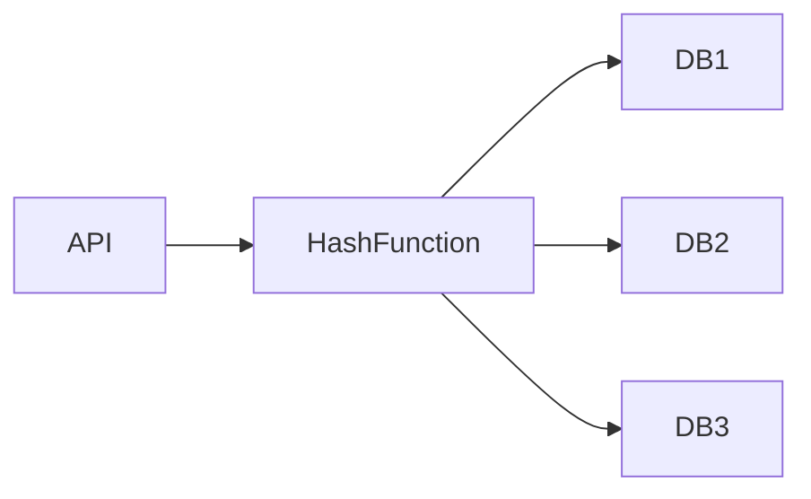

# Design a URL Shortener (TinyURL / Bitly-like System)

## 1. Problem Statement

A **URL Shortener** converts long URLs into short, compact links that are easier to share.

Example:

```
Original URL
https://www.example.com/articles/system-design/designing-a-distributed-url-shortener

Short URL
https://short.ly/ab12CD
```

When a user visits the short URL, the system **redirects them to the original long URL**.

This system must support:

* Massive read traffic (redirect requests)
* Reliable URL mapping storage
* Fast redirection
* High availability

Real-world examples include services like **Bitly**, **TinyURL**, and **Rebrandly**.

---

## 2. Functional Requirements

### Core Features

* Generate a short URL for a long URL
* Redirect short URL → original URL
* Custom alias support (optional)
* URL expiration support (optional)
* Analytics (optional)

### Example

```
POST /shorten

Input:
https://example.com/very/long/url

Output:
https://short.ly/ab12CD
```

---

## 3. Non-Functional Requirements

| Requirement       | Description                           |
| ----------------- | ------------------------------------- |
| Low Latency       | Redirects must happen in milliseconds |
| High Availability | System should always resolve URLs     |
| Scalability       | Must support billions of URLs         |
| Durability        | URL mappings must never be lost       |
| Fault Tolerance   | System must survive node failures     |

### Expected Scale

Assume:

* **100M new URLs per day**
* **10:1 read/write ratio**
* **1000M redirects per day**

Estimated:

```
Write QPS ≈ 100M / 86400 ≈ 1157
Read QPS ≈ 11570
```

---

## 4. Back-of-the-Envelope Estimation

### URL Length

Short URL length = **6 characters**

Character set:

```
[a-zA-Z0-9]
```

Total possibilities:

```
62^6 = 56,800,235,584
```

≈ **56 Billion URLs**

### Storage Estimation

Assume:

```
Original URL = 200 bytes
Short key = 6 bytes
Metadata ≈ 50 bytes
```

Per record:

```
≈ 256 bytes
```

For **100M URLs/day**

```
100M × 256 bytes ≈ 25.6 GB/day
≈ 9.3 TB/year
```

---

## 5. High Level Architecture



### Components

| Component     | Role                              |
| ------------- | --------------------------------- |
| Load Balancer | Distributes incoming requests     |
| API Servers   | Handle URL creation and redirects |
| Cache         | Stores hot URL mappings           |
| URL Service   | Core business logic               |
| Database      | Persistent URL mapping storage    |
| ID Generator  | Generates unique short IDs        |

---

## 6. Core Components Deep Dive

### API Layer

Handles:

```
POST /shorten
GET /{shortCode}
```

Responsibilities:

* Validation
* Rate limiting
* Authentication (optional)

---

### Cache Layer

Typically **Redis**

Purpose:

* Store frequently accessed URL mappings
* Reduce database reads

Example:

```
Key: ab12CD
Value: https://example.com/long/url
```

TTL may be applied.

---

### Database Layer

Stores the permanent mapping.

Possible databases:

| Option    | Pros               | Cons                 |
| --------- | ------------------ | -------------------- |
| MySQL     | Strong consistency | Harder to scale      |
| Cassandra | Highly scalable    | Eventual consistency |
| DynamoDB  | Managed scaling    | Cost                 |

---

### ID Generation Service

Generates unique IDs for short URLs.

Possible methods:

| Method                   | Description                      |
| ------------------------ | -------------------------------- |
| Auto-increment           | Simple but hard to scale         |
| Distributed ID generator | Scalable                         |
| Hashing                  | Deterministic but collision risk |

---

## 7. Data Model

### URL Table

| Field      | Type      |
| ---------- | --------- |
| id         | bigint    |
| short_code | varchar   |
| long_url   | text      |
| created_at | timestamp |
| expiry     | timestamp |

---

### ER Diagram



Indexes:

```
PRIMARY KEY (short_code)
```

---

## 8. API Design

### Create Short URL

```
POST /shorten
```

Request

```json
{
 "url": "https://example.com/article"
}
```

Response

```json
{
 "short_url": "https://short.ly/ab12CD"
}
```

---

### Redirect

```
GET /ab12CD
```

Response

```
HTTP 301 Redirect
Location: https://example.com/article
```

---

## 9. Request Workflow

This flow describes what happens when a user wants to generate a short URL.

---

### Step 1 — User Sends URL Shortening Request

The user sends a request to shorten a long URL.

Example request:

```
POST /shorten
```

Request body:

```json
{
 "url": "https://example.com/article"
}
```

This request enters the system through the public endpoint.

---

### Step 2 — DNS Resolution

Before the request reaches the application servers, DNS resolves the domain of the URL shortening service.

Example:

```
short.ly → IP Address of Load Balancer
```

DNS ensures the request reaches the correct infrastructure.

---

### Step 3 — Load Balancer Distributes the Request

The load balancer distributes incoming traffic among multiple API servers.

This ensures:

* horizontal scalability
* better fault tolerance
* efficient resource utilization



If one API server fails, the load balancer redirects traffic to other healthy servers.

---

### Step 4 — API Server Validates the Request

The API server performs initial checks such as:

* URL format validation
* checking if the URL already exists
* authentication or rate limiting

Example validation checks:

```
Is URL valid?
Is URL already shortened?
Is the request allowed?
```

If validation fails, the API returns an error response.

---

### Step 5 — Generate Unique ID

Once validated, the API server calls the **ID Generator service** to produce a unique identifier.



Example generated numeric ID:

```
912873
```

This ID will later be converted into the short code.

---

### Step 6 — Convert ID to Short Code

The numeric ID is encoded using **Base62 encoding** to produce a short and URL-friendly string.

Example conversion:

```
912873 → Base62 → ab12CD
```

Base62 uses the character set:

```
0123456789abcdefghijklmnopqrstuvwxyzABCDEFGHIJKLMNOPQRSTUVWXYZ
```

Advantages of Base62:

* shorter URLs
* large keyspace
* URL-safe characters

---

### Step 7 — Store Mapping in Database

The system stores the mapping between the generated short code and the original URL.



Stored record:

| short_code | long_url                                                   |
| ---------- | ---------------------------------------------------------- |
| ab12CD     | [https://example.com/article](https://example.com/article) |

This ensures the system can later resolve the short URL.

---

### Step 8 — Return Short URL to User

The API server returns the shortened URL to the user.

Response example:

```json
{
 "short_url": "https://short.ly/ab12CD"
}
```

The user can now share this short URL.

---

### Complete URL Creation Sequence



---

## 10. Redirect Flow

The redirect flow occurs when someone clicks or visits a short URL.

This operation must be extremely fast because it represents the **majority of system traffic**.

---

### Step 1 — User Opens Short URL

Example request:

```
GET https://short.ly/ab12CD
```

The request again goes through DNS and the load balancer before reaching an API server.

---

### Step 2 — API Server Extracts Short Code

The API server extracts the identifier from the URL.

Example:

```
short.ly/ab12CD
```

Extracted code:

```
ab12CD
```

This code will be used to retrieve the original URL.

---

### Step 3 — Check Cache First

Since redirect operations happen frequently, the system first checks the cache.



Cache lookup:

```
Key = ab12CD
```

---

### Step 4 — Cache Hit Scenario

If the mapping exists in cache, the system immediately retrieves the long URL.

Example:

```
Cache Result → https://example.com/article
```

This avoids a database query and dramatically reduces latency.

---

### Step 5 — Cache Miss Scenario

If the cache does not contain the mapping:

1. API queries the database
2. Database returns the original URL
3. API stores the result in cache for future requests



---

### Step 6 — Redirect User

The API returns an HTTP redirect response.

```
HTTP 301 Redirect
Location: https://example.com/article
```

The user's browser then navigates to the original URL.

---

### Complete Redirect Sequence



---

## 11. Scaling the System

### Load Balancing

Multiple stateless API servers.

```
Clients → Load Balancer → API Servers
```

---

### Database Sharding

Partition based on **short_code hash**.



Benefits:

* Horizontal scaling
* Reduced load per database

---

### Caching Strategy

Use **Redis cluster**.

Hot URLs cached.

Typical cache hit ratio:

```
> 80%
```

---

### CDN Optimization

Popular URLs can be cached via **CDN edge nodes**.

Benefits:

* Faster redirects
* Reduced backend load

---

## 12. Bottlenecks and Solutions

| Problem           | Solution                 |
| ----------------- | ------------------------ |
| Database overload | Use cache                |
| Hot URLs          | CDN caching              |
| ID collisions     | Distributed ID generator |
| Traffic spikes    | Auto scaling             |

---

## 13. Security Considerations

* Rate limiting to prevent abuse
* Spam URL detection
* Blacklist malicious domains
* Authentication for API usage

---

## 14. Monitoring & Observability

Key metrics:

| Metric           | Description         |
| ---------------- | ------------------- |
| Redirect latency | Time to resolve URL |
| Cache hit ratio  | Cache efficiency    |
| Error rate       | Failed requests     |
| QPS              | Traffic volume      |

Tools:

* Prometheus
* Grafana
* ELK Stack

---

## 15. Technology Stack

| Layer     | Technology          |
| --------- | ------------------- |
| API       | Go / Java / Node.js |
| Cache     | Redis               |
| Database  | MySQL / Cassandra   |
| Messaging | Kafka (analytics)   |
| Storage   | S3 (logs)           |
| CDN       | Cloudflare          |

---

## Summary

A scalable URL shortener relies on:

* **Base62 encoded IDs**
* **Fast cache lookups**
* **Sharded databases**
* **Stateless API servers**
* **Load balancing**

The system prioritizes **read performance**, as redirect traffic dominates writes.

With caching and horizontal scaling, the architecture can support **billions of URLs and high redirect throughput**.

---
