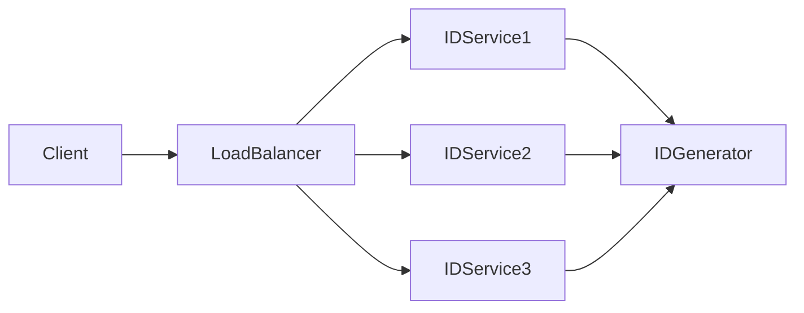
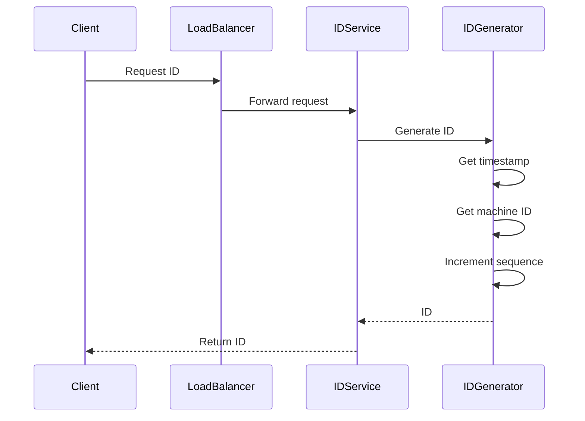

# Design a Unique ID Generator in Distributed Systems

## 1. Problem Statement

A **Unique ID Generator** is a system responsible for generating **globally unique identifiers** across distributed services without collisions.

These IDs are used in:

* databases (primary keys)
* distributed systems (event IDs, request IDs)
* order systems (order_id, transaction_id)
* microservices communication

The system must ensure:

* uniqueness across machines
* high throughput generation
* low latency
* scalability

Real-world systems include **Twitter Snowflake IDs**, **Instagram ID systems**, and **Discord snowflake-based IDs**.

---

## 2. Functional Requirements

### Core Features

* Generate globally unique IDs
* IDs should be sortable (time-ordered preferred)
* Support high throughput (millions of IDs/sec)
* Work across multiple nodes/data centers
* Avoid collisions

---

### Example

```id="bb0klc"
Request → Generate ID
```

Output:

```id="o9z95v"
ID = 18273645192837465
```

---

## 3. Non-Functional Requirements

| Requirement     | Description                              |
| --------------- | ---------------------------------------- |
| Uniqueness      | No duplicate IDs                         |
| Scalability     | Must work across distributed systems     |
| Low Latency     | ID generation should be fast             |
| High Throughput | Handle millions of requests/sec          |
| Fault Tolerance | System should work despite node failures |
| Ordering        | Prefer time-sortable IDs                 |

---

### Expected Scale

Assume:

* **1 Billion IDs/day**
* Peak: **100K IDs/sec**

Each node should independently generate IDs without coordination.

---

## 4. Back-of-the-Envelope Estimation

Assume 64-bit IDs.

```id="m3rj0t"
Total possible IDs = 2^64 ≈ 1.8e19
```

This is sufficient for global scale.

---

### Snowflake-style Bit Allocation

```id="9m0y9h"
64 bits:
| 1 bit unused | 41 bits timestamp | 10 bits machine ID | 12 bits sequence |
```

---

### Capacity

| Field      | Bits | Capacity         |
| ---------- | ---- | ---------------- |
| Timestamp  | 41   | ~69 years        |
| Machine ID | 10   | 1024 nodes       |
| Sequence   | 12   | 4096 IDs/ms/node |

---

## 5. High Level Architecture

Each node generates IDs **independently**, avoiding central bottlenecks.



---

### Components

| Component           | Role                    |
| ------------------- | ----------------------- |
| Client              | Requests ID             |
| Load Balancer       | Distributes requests    |
| ID Service          | Handles API requests    |
| ID Generator        | Generates unique IDs    |
| Machine ID Provider | Assigns unique node IDs |

---

## 6. Core Components Deep Dive

### ID Generator (Snowflake Logic)

Generates IDs using:

```id="e6np9o"
ID = timestamp | machine_id | sequence
```

Ensures:

* uniqueness
* ordering
* decentralization

---

### Timestamp

* Uses current time in milliseconds
* Ensures ordering of IDs

---

### Machine ID

* Each node gets a unique ID
* Prevents collision across nodes

---

### Sequence Number

* Incremented for each ID generated within the same millisecond

Example:

```id="n3p1pv"
0001, 0002, 0003 ...
```

---

## 7. Data Model

IDs are typically stored as **64-bit integers**.

Example:

| ID                | Created At |
| ----------------- | ---------- |
| 18273645192837465 | timestamp  |

No complex schema required.

---

## 8. API Design

### Generate ID

```id="o8xfjv"
GET /generate-id
```

Response:

```json
{
 "id": 18273645192837465
}
```

---

## 9. Request Workflow

This flow explains how an ID is generated in a distributed system.

---

### Step 1 — Client Requests ID

```id="8scu6c"
GET /generate-id
```

---

### Step 2 — Load Balancer Routes Request


The request is routed to any available ID service instance.

---

### Step 3 — ID Generator Fetches Current Timestamp

```id="m8jq7x"
timestamp = current_time_in_ms
```

Example:

```id="c6k1g7"
timestamp = 1710000000000
```

---

### Step 4 — Assign Machine ID

Each node has a pre-assigned unique ID.

```id="6tz00g"
machine_id = 42
```

---

### Step 5 — Generate Sequence Number

If multiple requests occur in the same millisecond:

```id="ubavvq"
sequence = 0 → 4095
```

---

### Step 6 — Combine Bits to Form ID

```id="3z1ynl"
ID = (timestamp << 22) | (machine_id << 12) | sequence
```

Example output:

```id="mk17r4"
18273645192837465
```

---

### Step 7 — Return ID

The ID is returned to the client.

---

### Complete Flow



---

## 10. Handling Edge Cases

### Clock Drift

Problem:

* System clock moves backward

Solution:

* Reject requests temporarily
* Use NTP synchronization
* Maintain last timestamp

---

### Sequence Overflow

Problem:

* More than 4096 IDs generated in 1 ms

Solution:

```id="ww9e7n"
Wait until next millisecond
```

---

### Machine ID Collision

Problem:

* Two nodes share same machine ID

Solution:

* Use centralized registry (ZooKeeper, etcd)
* Assign unique IDs at startup

---

## 11. Scaling the System

### Horizontal Scaling

Add more ID generator nodes.

Each node generates IDs independently.

---

### Multi-Region Setup

Use region bits:

```id="c6z4rn"
timestamp | region | machine | sequence
```

---

### Load Distribution

Use stateless services behind load balancer.

---

## 12. Bottlenecks and Solutions

| Problem            | Solution                 |
| ------------------ | ------------------------ |
| Central bottleneck | Decentralized generation |
| Clock issues       | Time sync + safeguards   |
| Hot node           | Load balancing           |
| High throughput    | Sequence batching        |

---

## 13. Technology Stack

| Layer        | Technology       |
| ------------ | ---------------- |
| API          | Go / Java        |
| Coordination | ZooKeeper / etcd |
| Monitoring   | Prometheus       |
| Time Sync    | NTP              |

---

## Summary

A distributed unique ID generator:

* avoids central coordination
* ensures global uniqueness
* supports high throughput
* generates time-ordered IDs

Using a **Snowflake-like approach**, systems can efficiently generate billions of unique IDs with minimal latency and strong scalability.

---