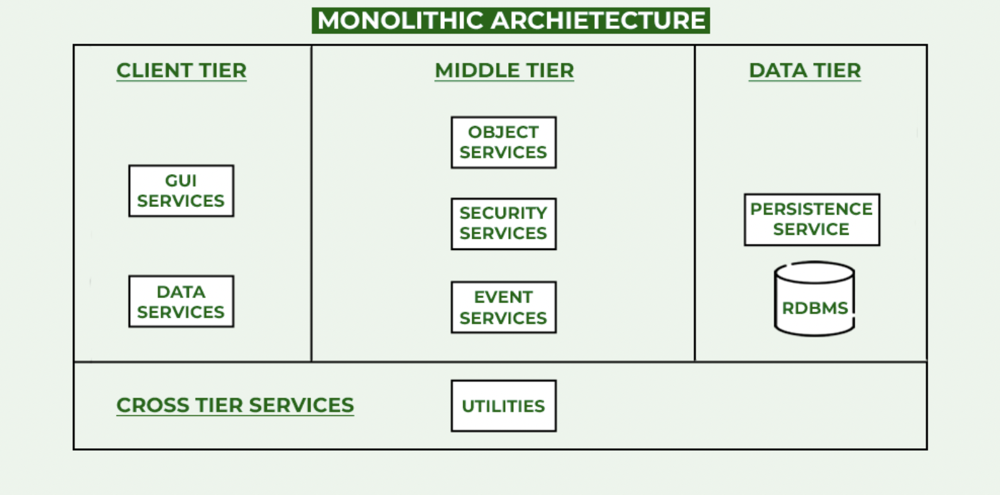
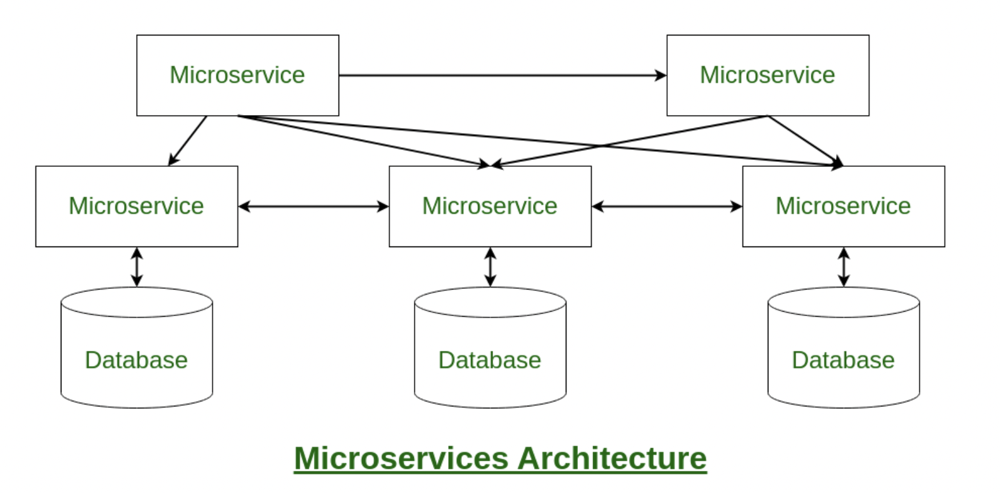
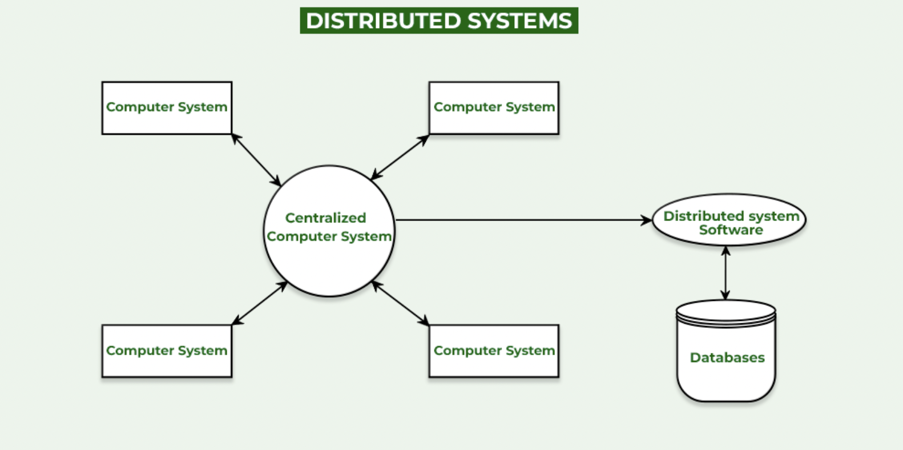

# Analysis of Monolithic and Microservices Systems

## What Is System Analysis?

**System Analysis** is the process of studying an existing or proposed system to 
understand its requirements, constraints, and behavior in order to clearly define 
what the system must accomplish.

It focuses on **requirement gathering and problem understanding**, not on solution design.

### Key Characteristics

- Identifies **functional and non-functional requirements**
- Understands business problems and system limitations
- Defines system scope and objectives
- Applies to both **new system development** and **system enhancement**
- Produces artifacts such as requirement documents, use cases, and diagrams

System Analysis serves as the **foundation for System Design**, ensuring that the 
solution is built on correct and validated requirements.

---

## Types of Systems in System Analysis and Design

### 1. **Monolithic Architecture**

If all the functionalities of a project exist in a single codebase, then that application is known as a `Monolithic application`.
A system where the whole web application is deployed as a single unit. Here all components and functionality are deployed in a single unit.



1. **Client Tier or User Layer**: The closest layer to the user and hence it can be either a webpage or a web application where the user gets things done.

2. **Middle Tier or Service Layer**: It compromises all the logic behind the application and is there in the application server.

3. **Data Tier or Persistence Layer**: It includes a data persistence mechanism(DB) and communication with other applications.

#### Advantages of Monolithic Architecture
- Easy development
- Easy deployment
- Easy testing

#### Disadvantages of Monolithic Architecture

- The codebase is stored in a single repository leading to difficulty in understanding. 
- Any updation will require complete redeployment of the software application. 
- Less reusable
- Less scalable


### 2. **Microservices Architecture**

`Microservices` is an architectural development style in which the application is made up of smaller services that handle a small portion of the functionality and data by communicating with each other directly using lightweight protocols like HTTP.



1. Instead of sharing a single database with other microservices, each microservice has its own database.

2. Having a database per microservice is essential if you want to benefit from this architecture.

3. Each microservice can use the type of database best suited for its needs.

4. Each service offers a secure module boundary so that different services can be written in different programming languages.

5. There are many patterns involved in microservice architecture like service discovery & registry, caching, API gateway & communication, observability, security, etc.


#### Advantages of Microservices Architecture

- Scalability
- Flexibility
- Resilience

#### Disadvantages of Microservices Architecture

- Increased complexity
- Distributed system, which can lead to additional challenges in terms of monitoring and management.
- Increased overhead in terms of network communication and data consistency.


### 3. **Distributed Systems**

```
A distributive system is a collection of multiple individual systems connected through a network sharing resources so as to achieve common goals. 
```


If you are incorporating Microservices architecture or migrating from Monolithic to Microservices architecture, you cannot do all work on a single system (as it is against the modular feature of Microservices). This is where `Distributed Systems` were developed. <br>

Distributed Systems not only provide modularity to architecture but also gives you the advantage to use Microservice architecture easily to utilize all its benefits.

