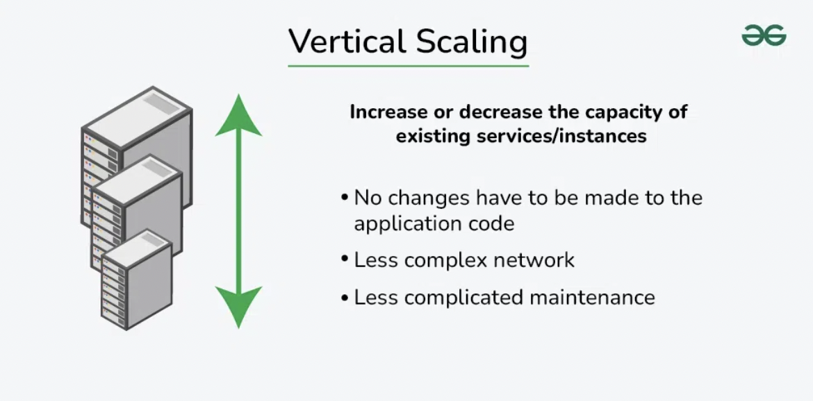
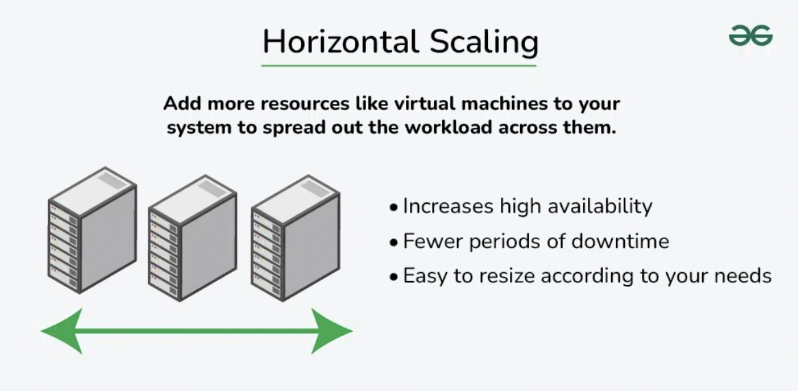

# What is Scalability?

- The ability of a system to accommodate a growing load or demand without compromising performance is referred to as scalability.

- When a system's workload or scope rises, it should be able to maintain or even improve its performance, efficiency, and dependability. 

## Importance of Scalability in System Design

- When a system is scalable, it can handle more users, data, and traffic without sacrificing speed or reliability.

- By dividing up the load among several servers, a scalable system increases overall performance.

- Ensuring availability to operate even in the event of unexpected spikes in traffic or component failures.

- Scalable systems are able to adjust their resources to meet demand variations by adding or subtracting resources as needed.

## Types of Scalability in System Design

### 1. Vertical Scaling

- Vertical scaling, also known as scaling up, refers to the process of increasing the capacity or capabilities of an individual hardware or software component within a system.

- You can add more power to your machine by adding better processors, increasing RAM, or other power-increasing adjustments.

#### Advantages of Vertical Scaling

- Improve a server's performance and capacity to handle more requests by improving its hardware.

- It is simple to implement and more user-friendly to handle than managing several servers.

#### Disadvantages of Vertical Scaling

- Limited Scalability

- Single Point of Failure

### 2. Horizontal Scaling

- Horizontal scaling, also known as scaling out, refers to the process of increasing the capacity or performance of a system by adding more machines or servers to distribute the workload across a larger number of individual units.

- There is no need to change the capacity of the server or replace the server.

#### Advantages of Horizontal Scaling

- By adding more servers, horizontal scaling allows your system to handle a larger number of incoming requests.

- With multiple servers, the workload can be distributed evenly using load balancing.

- Improves system reliability.

#### Disadvantages of Horizontal Scaling

- Increased Complexity

- Higher Costs

 

Scalability is a key factor in system design that allows applications and services to grow smoothly as demand increases. 

Achieving scalability involves using strategies like vertical scaling, horizontal scaling, and distributed architectures, which help distribute workloads efficiently and improve overall system resilience.