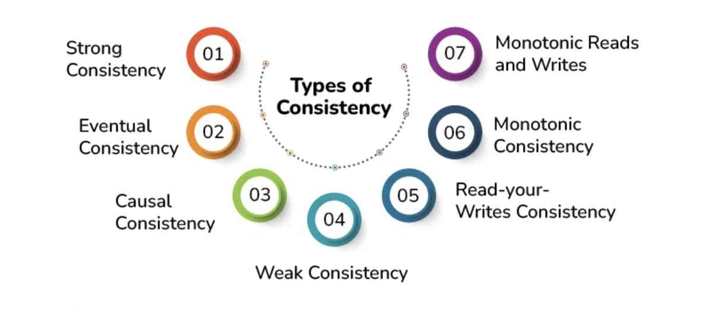

# Consistency in System Design

- Consistency in system design refers to the property of ensuring that all nodes in a distributed system have the same view of the data at any given point in time.

- Consistency guarantees that the information accessible by various system components is always `correct and up-to-date`.

- Lowers the possibility of mistakes and `inconsistencies` that could result in unpredictable behavior or corrupted data.

- The `integrity` of the data kept in the system is preserved by consistency, which aids in preventing data loss and corruption.

- It has `concurrency control` where it helps with access control to prevent conflicts and ensure that changes are applied in a coordinated way in distributed or multi-user systems.

## Types of Consistencies

### 1. Strong Consistency

- Also known as linearizability or strict consistency, this type guarantees that every read operation receives the most recent write operation's value or an error.

- Ensures all clients see the same sequence of updates and that updates appear to be instantaneous.

- **Example**: A traditional SQL database system with a single master node and multiple replicas ensures strong consistency. All replicas are updated synchronously, ensuring that all clients see a consistent view of the data.

### 2. Eventual Consistency

- Eventual consistency guarantees that data replicas will eventually converge to the same value even while it permits them to diverge briefly.

- Even though it could result in short-term inconsistencies, eventual consistency ensures that all modifications will eventually be shared and balanced.

- **Example**: Amazon's DynamoDB, a distributed NoSQL database, provides eventual consistency. When data is written to DynamoDB, it is initially stored locally on a single node and then asynchronously propagated to other nodes in the system.

### 3. Causal Consistency

- Causal consistency preserves the causality between related events in a distributed system. 

- If event A causally precedes event B, all nodes in the system will agree on this ordering.

- **Example**: A collaborative document editing application, where users can concurrently make edits to different sections of a document, requires causal consistency.

### 4. Read-Your-Writes Consistency

- After a client performs a write, it is guaranteed to **read its own update** on subsequent reads.

- Other clients might still see older data.

- **Example**: User updates their profile and immediately sees changes.

### 5. Monotonic Reads

- Ensures a client never reads **older data than a previous read**.

- Prevents “time travel” where a user could see an earlier state after seeing a newer one.

### 6. Session Consistency

- Guarantees consistency **within a single session**.

- Combines read-your-writes and monotonic reads for one user’s connection.

---

## Summary Table

| **Model**                | **Guarantee**                                | **Use Case**                           |
|--------------------------|-----------------------------------------------|-----------------------------------------|
| **Strong**               | Latest write always visible                   | Banking, inventory, payments            |
| **Eventual**             | Converges over time, temporary divergence     | Social feeds, DNS, caching systems      |
| **Causal**               | Maintains cause–effect ordering               | Collaborative apps, messaging           |
| **Read-Your-Writes**     | Client always sees its own updates            | User profile updates                    |
| **Monotonic Reads**      | No older reads after newer reads              | News feeds, timeline apps               |
| **Session Consistency**  | Guarantees within a user session              | Shopping carts, personal dashboards     |

--- 
