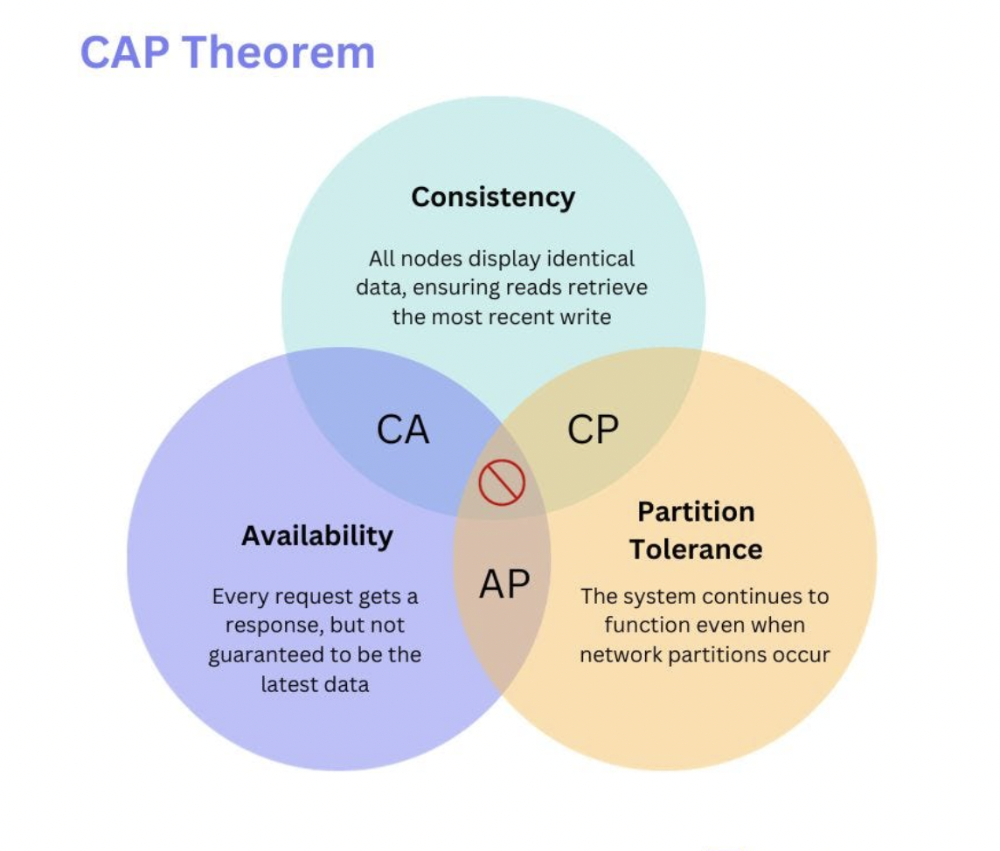

# CAP Theorem in System Design

According to the **CAP theorem**, only two of the three desirable characteristics — `consistency`, `availability`, and `partition tolerance` can be shared or present in a networked shared-data system or distributed system.

### 1. CA System

A CA System delivers consistency and availiability across all the nodes. It can't do this if there is a partition between any two nodes in the system and therefore does't support partition tolerance.

- Think of a traditional relational database system where all nodes are synchronized, ensuring that every read operation returns the most recent write operation's value. This system prioritizes consistency (C) and availability (A). The failure of any node or network partition would lead to unavailability of the system.

### 2. CP System

A CP System delivers consistency and partition tolerance at the expense of availability. When a partition occurs between two nodes, the systems shuts down the non-available node until the partition is resolved. Some of the examples of the databases are MongoDB, Redis, and HBase.

- Imagine a bank teller updating your account balance on a secure computer system. This system prioritizes consistency (C) and partition tolerance (P).

### 3. AP System

An AP System availabiiity and partition tolerance at the expense of consistency. When a partition occurs, all nodes remains available, but those at the wrong end of a partition might return an older version of data than others. Example: CouchDB, Cassandra and Dyanmo DB, etc.

- Think of your newsfeed on a social media platform constantly updating with new posts and stories. This system prioritizes availability (A) and partition tolerance (P).