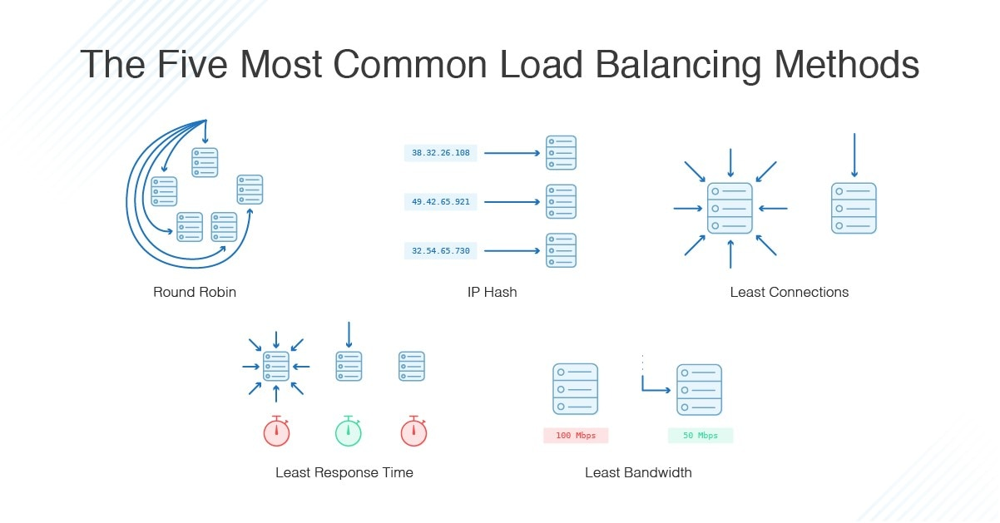

# Load Balancing Algorithms

## Definition

* **Load Balancing Algorithms** define **how incoming network requests are distributed** among multiple backend servers to optimize performance, minimize latency, and ensure efficient resource usage.

* The choice of algorithm directly impacts **scalability, fairness, and reliability** of the system.

---

## Types of Load Balancing Algorithms

### 1. Static Load Balancing

* Distribution is based on **predefined rules**.
* Does **not consider** current server load or real-time conditions.

| **Algorithm**            | **Description**                                                                                                           |
| ------------------------ | ------------------------------------------------------------------------------------------------------------------------- |
| **Round Robin**          | Requests are distributed sequentially to each server in a circular order. Simple and fair if servers have equal capacity. |
| **Weighted Round Robin** | Servers are assigned weights based on capacity (CPU, RAM). Servers with higher weights handle more requests.              |
| **IP Hashing**           | The client’s IP address is hashed to always direct the same client to the same server — useful for session persistence.   |

---

### 2. Dynamic Load Balancing

* **Adapts in real-time** based on server performance, active connections, or response time.

| **Algorithm**                 | **Description**                                                                                                    |
| ----------------------------- | ------------------------------------------------------------------------------------------------------------------ |
| **Least Connections**         | Routes new requests to the server with the fewest active connections. Ideal when requests vary in processing time. |
| **Least Response Time**       | Directs requests to the server with the lowest average response time and fewest connections.                       |
| **Resource-Based (Adaptive)** | Monitors server CPU, memory, and bandwidth to distribute load intelligently. Requires continuous monitoring.       |

---

### 3. Hybrid or Advanced Load Balancing

* Combines both static and dynamic methods for **optimized decision-making**.

| **Algorithm**                 | **Description**                                                                                                                                 |
| ----------------------------- | ----------------------------------------------------------------------------------------------------------------------------------------------- |
| **Consistent Hashing**        | Maps requests (like user ID or session ID) to specific servers. Minimizes cache misses when adding/removing servers. Common in CDNs and caches. |
| **Geographic Load Balancing** | Routes users to the nearest data center or region to minimize latency and improve performance.                                                  |
| **Random with Weighting**     | Randomly assigns requests while respecting server weights — balances simplicity and fairness.                                                   |

---

## Comparison Table

| **Algorithm Type** | **Examples**                           | **Key Benefit**                     | **Limitation**                    |
| ------------------ | -------------------------------------- | ----------------------------------- | --------------------------------- |
| **Static**         | Round Robin, Weighted RR, IP Hashing   | Simple and predictable              | Ignores real-time server load     |
| **Dynamic**        | Least Connections, Least Response Time | Adjusts to traffic and performance  | More complex, requires monitoring |
| **Hybrid**         | Consistent Hashing, Geo Load Balancing | Balances flexibility and efficiency | Setup and tuning are complex      |

---

## Choosing the Right Algorithm

| **Scenario**                       | **Recommended Algorithm**               |
| ---------------------------------- | --------------------------------------- |
| Uniform traffic, equal servers     | Round Robin / Weighted RR               |
| Varying request sizes or durations | Least Connections / Least Response Time |
| Session persistence needed         | IP Hashing / Consistent Hashing         |
| Global users                       | Geographic Load Balancing               |
| Resource-sensitive systems         | Resource-Based Adaptive                 |

---
