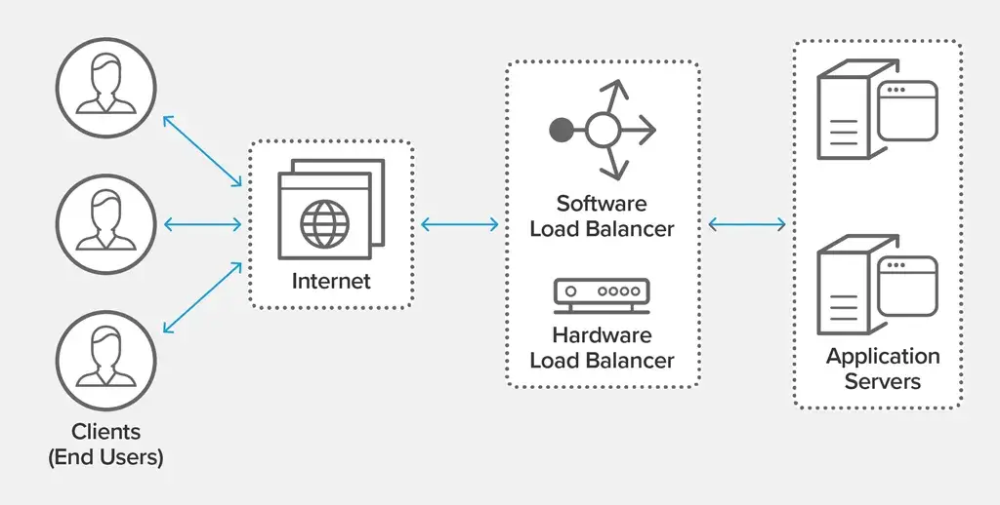
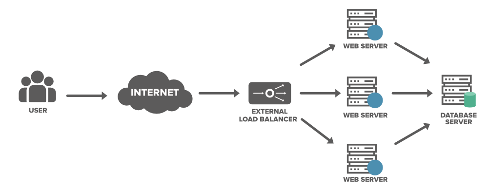

# Load Balancing

## Definition

- **Load Balancing** is the process of **distributing incoming network traffic across multiple servers** to ensure no single server is overloaded.  

- Improves **availability, scalability, performance, and fault tolerance** in distributed systems.

- A **load balancer** is a networking device or software application that distributes and balances the incoming traffic among the servers to provide high availability, efficient utilization of servers and high performance.

---

## Issues without Load Balancing

- **Single Point of Failure**: If one server goes down, the entire system can become unavailable.

- **Overloaded Servers**: Some servers may become overwhelmed with requests while others are underutilized, leading to poor performance.

- **Scalability Challenges**: Difficulty in handling increased traffic as the user base grows.

- **Latency Issues**: Users may experience delays if requests are not efficiently routed to the optimal server.

- **Maintenance Downtime**: Taking a server offline for maintenance can disrupt service if there is no load balancing.

---

## Key Responsibilities

- **Traffic Distribution:** Routes client requests evenly to healthy backend servers.  

- **Health Checks:** Continuously monitors servers and removes unhealthy ones.  

- **Failover:** Redirects traffic if a server or data center fails.  

- **SSL/TLS Termination:** Offloads encryption/decryption from backend servers.  

- **Session Persistence:** Supports “sticky sessions” if required.

---

## How Load Balancer Works?

1. **Client Request**: A user sends a request to the application (e.g., accessing a website).

2. **DNS Resolution**: The domain name resolves to the load balancer's IP address.

3. **Load Balancer Receives Request**: The load balancer accepts the incoming request.

4. **Health Check**: The load balancer checks the health of backend servers to ensure they are available to handle requests.

5. **Traffic Distribution**: Based on the chosen algorithm (e.g., round robin, least connections), the load balancer forwards the request to one of the healthy backend servers.

6. **Server Response**: The selected backend server processes the request and sends the response back to the load balancer.

7. **Response to Client**: The load balancer forwards the server's response back to the client.

---

## Load Balancer: Benefits vs Challenges

| **Benefits**                          | **Challenges**                                   |
|----------------------------------------|---------------------------------------------------|
| **High Availability**: Distributes traffic, avoiding single server failures. | **Single Point of Failure** if not set up redundantly. |
| **Scalability**: Handles traffic spikes by adding/removing servers. | **Extra Cost** for hardware, software, and maintenance. |
| **Better Performance**: Spreads load to reduce latency and improve response times. | **Added Latency** from the extra routing layer. |
| **Health Checks**: Removes unhealthy servers automatically. | **Configuration & Debugging Complexity**. |
| **Security**: Can offload SSL/TLS and filter malicious traffic. | **Requires Monitoring** to avoid becoming a bottleneck. |

---

