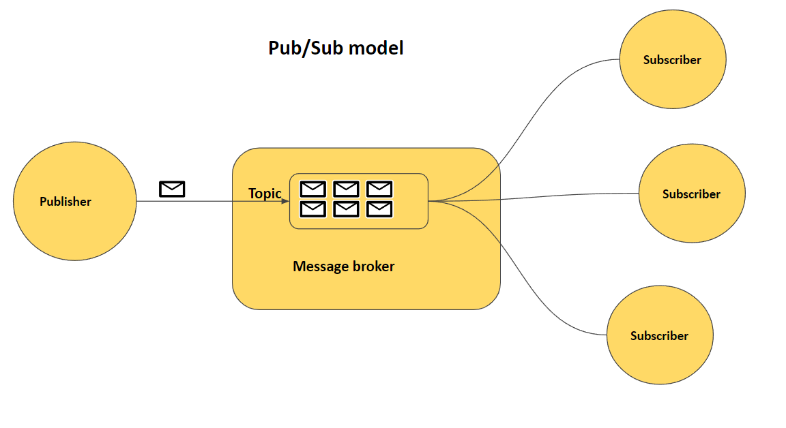

# Publish–Subscribe (Pub/Sub) Pattern

## Definition

The **Publish–Subscribe (Pub/Sub) pattern** is a messaging communication pattern where **producers (publishers)** send messages to a **topic**, and **consumers (subscribers)** receive messages from that topic **without direct knowledge of each other**.

Publishers and subscribers are **loosely coupled**, meaning they do not communicate directly.

---

## Why Pub/Sub Is Needed

In large distributed systems:

* multiple services may need the same event

* producers should not know who consumes the data

* new consumers should be added without changing producers

Pub/Sub enables:

* event-driven architectures
* scalable fan-out of messages
* flexible system evolution

---

## How Pub/Sub Works

1. A **publisher** sends a message to a **topic**.

2. The messaging system stores or forwards the message.

3. All **subscribers** subscribed to that topic receive a copy of the message.

4. Each subscriber processes the message independently.

---

## Key Components

### Publisher

* Produces events or messages.
* Sends messages to a topic.
* Does not know who consumes the message.

### Topic

* Logical channel where messages are published.
* Acts as an intermediary between publishers and subscribers.

### Subscriber

* Subscribes to one or more topics.
* Receives and processes messages.

### Broker

* Manages topics, message delivery, and subscriptions.
* Examples: Kafka, RabbitMQ, Google Pub/Sub.

---

## Pub/Sub vs Point-to-Point Queues

| Aspect           | Pub/Sub              | Queue (Point-to-Point) |
| ---------------- | -------------------- | ---------------------- |
| Message delivery | One-to-many          | One-to-one             |
| Consumers        | Multiple subscribers | Single consumer        |
| Use case         | Event broadcasting   | Task processing        |
| Coupling         | Loosely coupled      | Moderately coupled     |

---

## Common Use Cases

* event notifications
* activity feeds
* logging and monitoring
* real-time analytics
* microservice event communication

---

## Popular Pub/Sub Systems

* **Apache Kafka** (topics and partitions)

* **RabbitMQ** (fanout and topic exchanges)

* **Google Pub/Sub**

* **AWS SNS**

* **Azure Event Grid**

---

## Advantages vs Disadvantages

| Advantages                          | Disadvantages                      |
| ----------------------------------- | ---------------------------------- |
| Decouples producers and consumers   | Increased complexity               |
| Scalable message distribution       | Potential message delivery delays  |
| Supports multiple subscribers       | Requires message broker management |
| Flexible system evolution           | Possible message ordering issues   |

---

## Summary

* Pub/Sub decouples producers from consumers using topics.

* One message can be delivered to multiple subscribers.

* Ideal for event-driven and scalable architectures.

* Commonly implemented using Kafka, RabbitMQ, and cloud messaging services.

---
