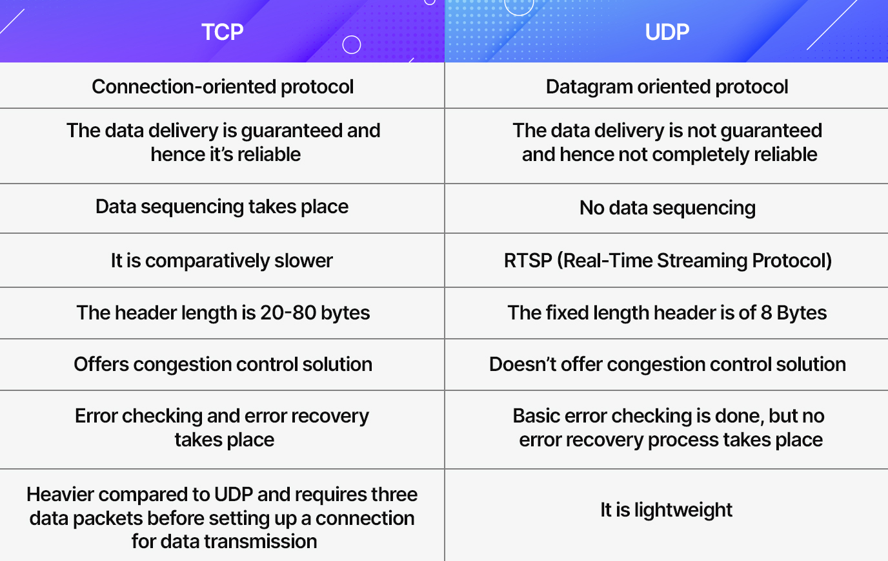

# Networking Basics for System Design

## HTTP (HyperText Transfer Protocol)

- **Definition**: HTTP is an application layer protocol used for transmitting hypermedia documents, such as HTML.  

- **Connection**: Stateless, text-based request-response model.  

- **Port**: By default, HTTP operates over **port 80**.  

### Features of HTTP

- Text-based and easy to implement.

- Stateless (each request is independent).

- Faster due to no encryption overhead.

- Less secure (data is sent as plain text).

### Working:

  - Client sends an HTTP request (methods like `GET`, `POST`, `PUT`, `DELETE`).  

  - Server responds with status codes (e.g., `200 OK`, `404 Not Found`, `500 Internal Server Error`).  

### Drawbacks:

  - Communication is **not encrypted**.

  - Vulnerable to eavesdropping and man-in-the-middle attacks.  

---

## HTTPS (HyperText Transfer Protocol Secure)

- **Definition**: Secure version of HTTP, adds encryption via **TLS/SSL**.  

- **Port**: By default, HTTPS operates over **port 443**.  

### How It Works:

  - Uses **TLS (Transport Layer Security)** or SSL to encrypt data.

  - Prevents interception, tampering, and eavesdropping.  

### Features of HTTPS
  
  - **Confidentiality**: Data is encrypted.  
  
  - **Integrity**: Prevents modification of data during transfer.  
  
  - **Authentication**: Verifies server identity via certificates (issued by CAs).  

 **Usage**: Widely used in APIs, web apps, e-commerce, banking.  

---

## Differences: HTTP vs HTTPS

| **Feature** |	**HTTP** | **HTTPS** |
|---------|------|------|
| **Port**	 | 80 | 443 |
| **Security** | Not encrypted | Encrypted with TLS/SSL |
| **Performance** | Faster (no encryption) |	Slightly slower (encryption overhead) |
| **Use Case**	| Non-sensitive content	| Banking, login, transactions, etc. |

---

## Differences: SSL vs TLS

`Secure Socket Layer` and `Transport Layer Security` are the protocols used to provide security between web browsers and web servers. 

| **Aspect** | **SSL** | **TLS** |
|------------|---------|---------|
| **Full Form** | Secure Socket Layer | Transport Layer Security |
| **Algorithm Support** | Supports Fortezza algorithm | Does not support Fortezza algorithm |
| **Authentication Protocol** | Message Authentication Code (MAC) protocol | Hashed Message Authentication Code (HMAC) protocol |
| **Complexity** | More complex | Simpler than SSL |
| **Security** | Less secure | Provides higher security |
| **Performance** | Less reliable and slower | More reliable, upgraded, and with lower latency |
| **Status** | Deprecated | Still widely used |
| **Connection Setup** | Uses **port** to set up explicit connection | Uses **protocol** to set up implicit connection |

---

## TCP (Transmission Control Protocol)

- **Type**: Connection-oriented. 

- **Features**:
  - Three-way handshake (SYN, SYN-ACK, ACK).  
  - Reliable delivery: Lost packets retransmitted.  
  - Maintains packet order.  

- **Use Cases**: Web (HTTP/HTTPS), Email (SMTP), File transfers (FTP).  

---

## UDP (User Datagram Protocol)

- **Type**: Connectionless.  

- **Features**:
  - No handshake.  
  - No guarantee of delivery or order.  
  - Lightweight and faster.  

- **Use Cases**: Real-time communication (VoIP, video conferencing, gaming).  

---

## Internet Protocol (IP)

- Any data which is sent between two devices is sent in the form of IP packets.

- An IP packet has two parts `header` and `data`. The header has some information about the source, destination, and the version of IP such as IPV4 or IPV6 and packet size.

- The data part consists of the data to be sent.

- However, IP packet size is limited typically around 0.065MB so to share any data multiple IP packets are sent to the destination.

- The major problem with IP is it doesn’t maintain the order of data sent so that’s why TCP came into the picture.

---