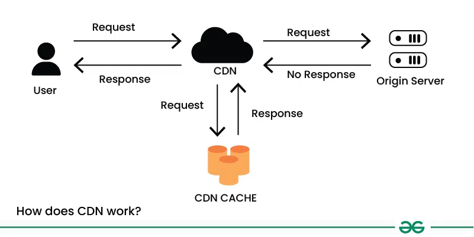

# Content Delivery Network

## Definition

- A **content delivery network (CDN)** is a globally distributed network of proxy servers, serving content from locations closer to the user. 

- Generally, static files such as HTML/CSS/JS, photos, and videos are served from CDN, although some CDNs such as **Amazon's CloudFront** support dynamic content. The site's DNS resolution will tell clients which server to contact.

- Help improve the performance, reliability, and scalability of websites / applications and web applications by caching content closer to users, reducing latency, and offloading traffic from origin servers.

--- 

## Why CDNs Are Important

- **Faster Load Times:** Serving content from edge servers closer to users reduces round-trip time (RTT).

- **Scalability:** Absorbs sudden spikes in traffic (e.g., product launches, live events).

- **High Availability & Reliability:** If one edge server fails, requests are automatically routed to the next best location.

- **Security Benefits:** Provides DDoS protection, Web Application Firewall (WAF), TLS/SSL termination, and bot mitigation.

- **Lower Bandwidth Costs:** Reduces data transfer from the origin server by caching static content.

---

## CDN vs. No CDN

| Aspect                | Without CDN                               | With CDN                                               |
|-----------------------|--------------------------------------------|--------------------------------------------------------|
| **Latency**           | High, as every request travels to the origin server. | Low, content served from nearest edge location.        |
| **Server Load**       | Origin server handles all traffic.         | Load distributed across global edge servers.           |
| **Scalability**       | Limited; origin may crash on traffic spikes.| Easily handles sudden surges via global network.       |
| **Availability**      | Single point of failure if origin is down. | Multiple redundant nodes ensure uptime.                |
| **Bandwidth Costs**   | Higher, as all content comes from origin.  | Lower, due to caching and reduced origin traffic.      |
| **Security**          | Must handle DDoS and SSL/TLS at origin.    | Built-in DDoS mitigation and TLS offloading.           |

---

## Types of CDNs

1. **Public CDNs**: Any CDN that is accessible to everybody online. These CDNs are used to swiftly and effectively provide content, including pictures, movies, and other static files, to users

2. **Private CDNs**: A CDN that is only utilized by one firm or organization. These CDNs are used to distribute content to internal users or clients, and they are frequently set up on a private cloud or within an organization's own infrastructure.

3. **Hybrid CDNs**: Combines elements of both public and private CDNs. In a hybrid CDN, some content is delivered using a public CDN, while other content is delivered using a private CDN.

4. **Push CDNs**: Push CDNs receives new content whenever changes occur on your server. You take full responsibility for providing content, uploading directly to the CDN and rewriting URLs to point to the CDN. 

    -  Push CDNs are often used for caching large files or content that is not frequently updated.

    - Eg: `KeyCDN`, `CDN77`

5. **Pull CDNs**: Pull CDNs grab new content from your server when the first user requests the content. You leave the content on your server and rewrite URLs to point to the CDN.

    -  Pull CDNs are often used for delivering dynamic content, such as web pages or API responses.

    - Eg: `Amazon CloudFront`, `Cloudflare`

--- 

## How a CDN Works

1. **User Request**  
   - A visitor requests content, e.g., `https://example.com/image.jpg`.

2. **DNS Resolution**  
   - The domain’s DNS points the user to the nearest CDN **edge server** instead of the origin.

3. **Cache Lookup**  
   - If the edge server has the content cached (a *cache hit*), it serves it immediately.
   - If not (*cache miss*), the edge requests it from the **origin server**, caches it, and then delivers it to the user.

4. **Future Requests**  
   - Subsequent requests from nearby users are served directly from the edge cache.

---

## Key Components

- **Origin Server**: The main server hosting the original content.

- **Edge Servers (PoPs)**: CDN data centers worldwide that cache and serve content to users.

- **Caching & TTL**: Rules defining how long content stays in the edge cache before refreshing.

- **Load Balancing**: Distributes traffic across multiple edge servers to optimize performance and reliability.

- **Security Features**: DDoS protection, WAF, SSL/TLS termination, etc.

---

## Use Cases

- **E-commerce & Media**: Handle global traffic during sales or events.

- **Gaming**: Distribute game patches and updates quickly.

- **Video Streaming**: Reduce buffering and improve playback quality.

- **Software Delivery**: Distribute large files and updates efficiently.

---

## CDN: Benefits vs Challenges

| **Benefits**                      | **Challenges**                               |
|------------------------------------|-----------------------------------------------|
| Faster load times (low latency)    | Added cost for high traffic or large sites    |
| High availability & reliability    | Cache invalidation can be tricky              |
| Handles traffic spikes (scalable)  | Setup/configuration complexity                |
| Built-in security (DDoS, SSL/TLS)  | Limited caching for dynamic content           |
| Lower origin bandwidth costs       | Possible vendor lock-in                       |

--- 