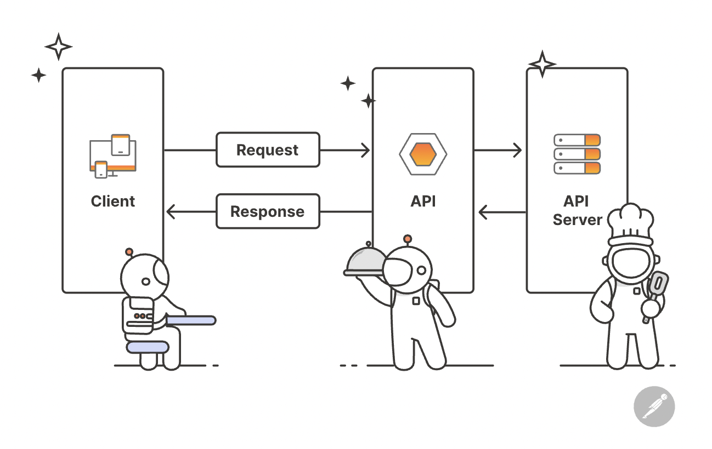
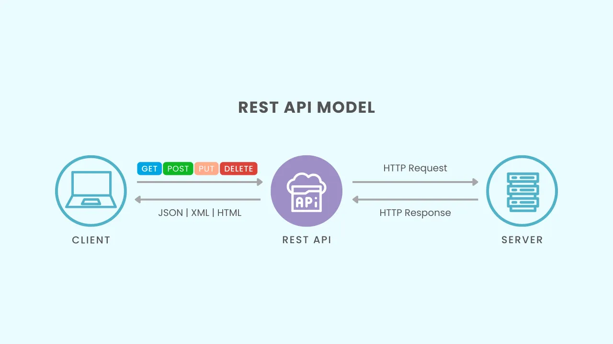
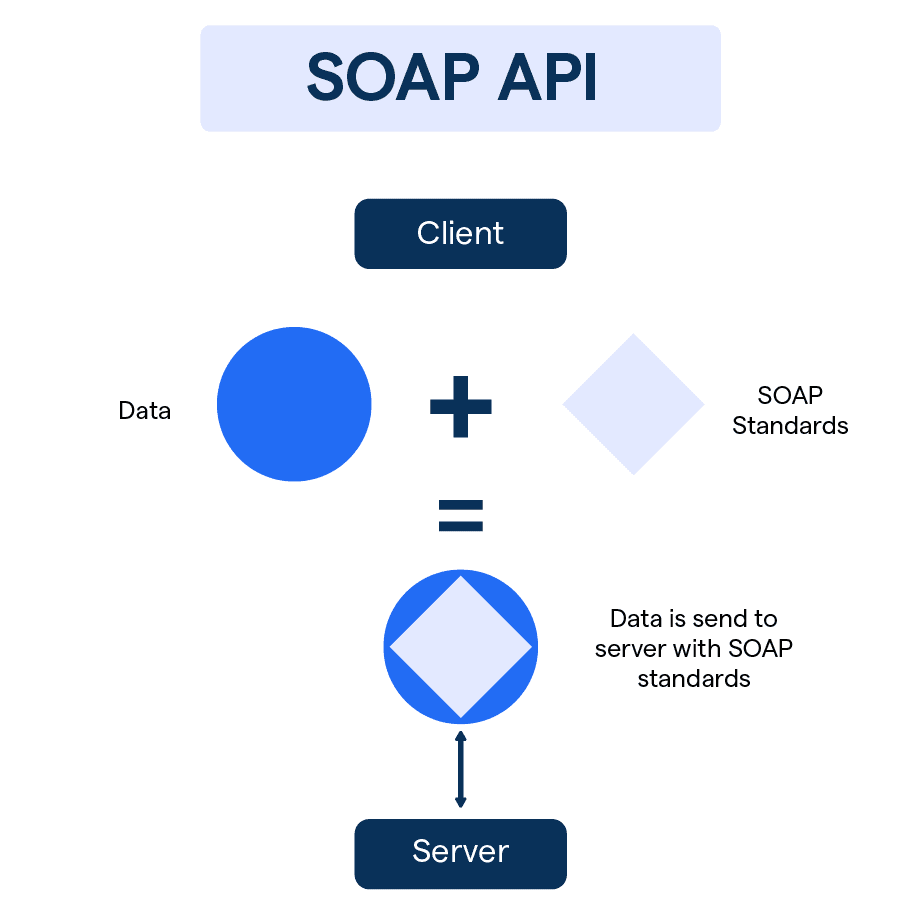

# API Communication

## Definition

API (Application Programming Interface) communication enables interaction between services, applications, or devices. 

- It defines **how data is requested, transferred, and consumed** across systems. 

- It is the backbone of **microservices, distributed systems, and client–server applications**.

- `All web services are APIs, but not all APIs are web`

- Today, over 80% of modern web applications rely on APIs to fetch data, integrate with third-party services, or enable features like login, payments, or real-time updates.

---

## Why Do We Need APIs

APIs help developers to create software programs more easily. Instead of writing complex code from scratch, they can call APIs that already provide the functions they need.

- E.g, If a developer wants to display a weather report, they can use an API to get the data instead of creating the entire system to gather weather data themselves.

## How Do APIs Work?

APIs work in a simple step-by-step process:

- **Request**: A client (user) sends a request through the API's URI (Uniform Resource Identifier).

- **Processing**: The API forwards the request to the server.

- **Response**: The server processes the request and sends the response back to the API.

- **Delivery**: The API returns the server's response to the client.

--- 

## Types of APIs

### 1. REST (Representational State Transfer)

- REST APIs work by sending requests and receiving responses, typically in JSON format, between the client and server.

- A request is sent from the client to the server via a web URL, using one of the **HTTP** methods.

- The server then responds with the requested resource, which could be **HTML, XML, Image, or JSON**, with JSON being the most commonly used format for modern web services.

- These methods map to **CRUD operations (Create, Read, Update, Delete)** for managing resources on the web.

- **Pros**:

  - Simple, language-agnostic, browser-friendly.

  - Great for public APIs and CRUD operations.

- **Cons**:

  - Over-fetching or under-fetching of data.

  - No built-in real-time capabilities.

#### Common HTTP Methods

1. **GET Method**: Used to retrieve data from a server. It is a read-only operation and does not modify any data.
   - Example: Fetching user details from a database.

2. **POST Method**: Used to send data to a server to create a new resource. It is often used for submitting forms or uploading files.
   - Example: Creating a new user account.

3. **PUT Method**: Used to update an existing resource on the server. It replaces the entire resource with the new data provided.
    - Example: Updating user profile information.

4. **DELETE Method**: Used to remove a resource from the server.
    - Example: Deleting a user account.

#### Common Use Cases

- **Web Services**: Public APIs for services like Twitter, Google Maps, etc.

- **Mobile Apps**: Backend communication for apps like Instagram, Uber, etc.

- **Single Page Applications (SPAs)**: Dynamic content loading without full page reloads.

---

### 2. gRPC (Google Remote Procedure Call)

- **gRPC** is a high-performance, open-source framework developed by Google for remote procedure calls (RPC).  

- It uses **HTTP/2** as the transport protocol and **Protocol Buffers (Protobuf)** as the interface definition language and serialization format.

#### How it Works

  1. The client calls a method as if it were a local function.
 
  2. The request is serialized into binary Protobuf format.
 
  3. HTTP/2 streams the request to the server.
 
  4. The server processes the call and returns a Protobuf-encoded response.

- **Key Features**:
  
  - **Bi-directional Streaming**: Client and server can send multiple messages over a single connection simultaneously.
  
  - **Strong Typing**: `.proto` files define service contracts and message structures.
  
  - **Code Generation**: Automatically generates client/server code for many languages (Go, Java, Python, C++, etc.).

- **Pros**:
  
  - Extremely fast and bandwidth-efficient (binary serialization).
  
  - Built-in authentication (TLS), load balancing, and flow control.
  
  - Ideal for **microservices**, **IoT**, and **real-time applications**.

- **Cons**:
  
  - More complex setup than REST (requires `.proto` files and tooling).
  
  - Debugging binary messages is harder than JSON.

#### Common Use Cases

- **Microservices Communication**: Efficient inter-service communication in distributed systems.

- **Real-Time Streaming**: Live data feeds, chat applications, gaming.

- **IoT Devices**: Low-latency communication with constrained devices.

---

### 3. WebSockets

- **WebSockets** provide a **full-duplex, persistent TCP connection** that enables **real-time, two-way communication** between the client and server.

- The connection starts with an **HTTP handshake**, after which the protocol switches to WebSocket and the same TCP connection remains open for the entire session.

- Once established, **both client and server can send messages at any time** without repeatedly initiating new HTTP requests, allowing for real-time, two-way communication.

#### How It Works

1. **Handshake**: Client sends an HTTP request to upgrade the connection to WebSocket.

2. **Persistent Channel**: Server accepts, and the protocol switches to WebSocket over the same TCP connection.

3. **Two-Way Messaging**: Both client and server freely send/receive messages until one closes the connection.

- **Pros**:

  - Low-latency communication for instant updates.

  - More efficient than HTTP polling or long-polling.

  - Ideal for event-driven, real-time applications.

- **Cons**:

  - Not cache-friendly like standard HTTP.

  - Requires extra infrastructure for scaling and load balancing (e.g., sticky sessions).

#### Common Use Cases

- **Chat & Messaging Apps**: Real-time text or media delivery.

- **Live Dashboards & Stock Tickers**: Continuous data updates.

- **Online Gaming**: Instant player movement and state synchronization.

- **Collaborative Tools**: Shared document editing or whiteboards.

- **IoT Devices**: Constant sensor data streaming.

---

### 4. GraphQL

- **GraphQL** is a **query language** and **runtime** for APIs that allows clients to request **exactly the data they need**—nothing more, nothing less.

- Unlike REST, which has multiple endpoints, GraphQL typically exposes **a single endpoint** where clients specify the structure of the required response.

- The server returns data in **precisely the shape requested**, reducing **over-fetching** and **under-fetching** of data.

#### How It Works

1. **Schema Definition**: Server defines a type system (schema) describing all possible queries and mutations.

2. **Client Query**: Client sends a query specifying exactly which fields and relationships it needs.

3. **Resolver Execution**: Server resolves each requested field using resolvers and returns a JSON response shaped exactly like the query.

#### Core Operations

- **Query**: Read or fetch data (like HTTP GET).

- **Mutation**: Modify server-side data (like HTTP POST/PUT/DELETE).

- **Subscription**: Real-time updates over a persistent connection (often via WebSockets).

- **Pros**:

  - Fetch multiple related resources in a single request.

  - Strongly typed schema with built-in documentation and introspection.

  - Flexible and efficient for complex client requirements.

- **Cons**:

  - More complex server setup and caching.

  - Overly large or nested queries can impact performance.

#### Common Use Cases

- **Modern Web & Mobile Apps**: Single-page applications needing flexible data.

- **Microservices Aggregation**: Combine data from multiple services into one request.

- **Complex Nested Data**: E-commerce catalogs, social media feeds, dashboards.

---

### 5. SOAP (Simple Object Access Protocol)

- **SOAP** is a **protocol** for exchanging structured information between applications over a network, typically using **XML**.

- It is highly standardized and follows strict messaging rules defined by the **W3C**, making it suitable for **enterprise-level, mission-critical applications**.

- SOAP supports communication over multiple protocols like **HTTP**, **SMTP**, **TCP**, and more, though HTTP is most common.

#### Key Components

1. **Envelope**: Defines the start and end of the message and what it contains.

2. **Header**: Holds optional attributes like authentication or transaction details.

3. **Body**: Contains the actual XML data being exchanged.

4. **Fault**: Provides details about errors that occur while processing the message.

#### Typical Workflow

1. **Client Request**: Sends an XML request wrapped in a SOAP envelope to the server.

2. **Server Processing**: The server processes the request based on the defined WSDL (Web Services Description Language).

3. **Response**: The server responds with an XML SOAP message containing the requested data or error details.

- **Pros**:
  
  - Built-in error handling and strict standards.
  
  - Supports **WS-Security**, ACID transactions, and distributed computing.
  
  - Language and platform independent.

- **Cons**:
  
  - Verbose XML messages increase payload size.
  
  - Slower and more complex compared to REST or gRPC.
  
  - Requires strict contracts, reducing flexibility.

#### Common Use Cases

- **Banking & Financial Services**: Payment gateways, transaction systems.

- **Enterprise Integrations**: Legacy systems and B2B communication.

- **Telecommunications**: Billing systems and service provisioning.
---

## API Communication Methods – Comparison

| Feature / Aspect        | **REST**                           | **gRPC**                                   | **WebSockets**                                   | **GraphQL**                                         | **SOAP**                                            |
|-------------------------|-------------------------------------|---------------------------------------------|--------------------------------------------------|-----------------------------------------------------|-----------------------------------------------------|
| **Protocol**            | HTTP/1.1                            | HTTP/2                                     | TCP (persistent)                                 | HTTP/1.1 or HTTP/2                                  | HTTP, SMTP, TCP                                     |
| **Data Format**         | JSON (commonly), XML                | Protobuf (binary)                           | Text/Binary messages                              | JSON for queries/responses                           | XML                                                 |
| **Communication**       | Request–Response                    | Request–Response + Bi-directional streaming | Full-duplex, real-time                            | Request–Response (single endpoint)                   | Request–Response                                    |
| **Performance**         | Moderate (text-based)               | High (compact binary, multiplexing)         | High (low latency, persistent)                    | Moderate (depends on query complexity)               | Low (verbose XML)                                   |
| **Real-time Support**   | Limited (polling/long-polling)      | Native streaming                            | Excellent (ideal for live updates)                | Via subscriptions (WebSocket-based)                  | Limited (not designed for real-time)                |
| **Strong Typing**       | Optional (OpenAPI/Swagger)          | Yes (strict `.proto` contracts)             | No (manual schema if needed)                      | Yes (schema-driven)                                   | Yes (strict WSDL contracts)                         |
| **Ease of Adoption**    | Very easy, widely used             | Moderate (requires proto definitions)       | Moderate (requires persistent connection handling) | Moderate (schema and resolvers needed)               | Complex (strict standards, heavy XML)               |
| **Caching**             | Built-in HTTP caching              | Manual or custom                             | Not built-in                                      | Client/server-side caching possible                  | Limited                                             |
| **Use Cases**           | Public APIs, web/mobile backends    | High-performance microservices, IoT         | Chat, gaming, collaborative tools                 | Modern web/mobile apps, complex nested data          | Enterprise systems, banking, legacy integrations    |
| **Security**            | HTTPS/TLS                          | TLS + optional auth layers                  | TLS/WebSocket Secure (WSS)                        | HTTPS + custom auth                                  | WS-Security, built-in ACID compliance               |
| **Examples**            | Twitter API, GitHub API             | Google Cloud services, Kubernetes internals | Slack real-time messaging, multiplayer games      | GitHub GraphQL API, Shopify API                      | Payment gateways, telecom billing                   |

---