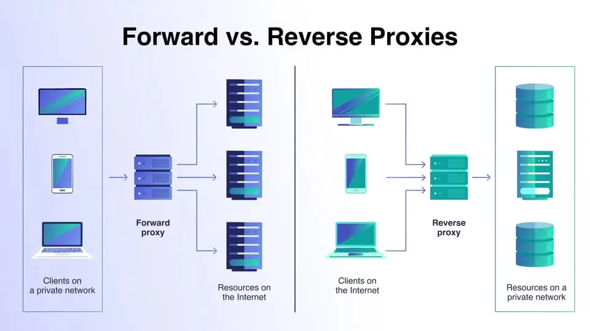

# Proxy and Reverse Proxy

## Definition

A **proxy** acts as an intermediary between a client and a server, forwarding requests and responses.  
They improve **security, performance, and scalability** in modern web architectures.

## Purpose of Proxy Servers

- **Content Filtering**: Block access to certain websites or content.

- **Anonymity**: Hide the client's IP address for privacy.

- **Caching**: Store copies of frequently accessed resources to reduce load times.

- **Access Control**: Restrict access to certain resources based on policies.

- **Load Balancing**: Distribute incoming requests across multiple servers to ensure no single server is overwhelmed.

---

## Types of Proxy Servers

### 1. Forward Proxy

- A **forward proxy** (or simply *proxy server*) sits **between the client and the internet**.

- The client sends requests to the proxy, which then forwards them to the destination server.

- The destination server sees the proxy as the client.

**Key Uses**

- **Privacy & Anonymity**: Hide client IPs and locations.

- **Access Control**: Restrict or filter outbound requests (e.g., corporate networks).

- **Caching**: Reduce bandwidth by caching frequently requested resources.

**When to Use**
  
  - Hide client identity.
  
  - Enforce network policies.
  
  - Control employee internet usage.

---

### 2. Reverse Proxy

- A **reverse proxy** sits **in front of web servers**, receiving client requests and forwarding them to the appropriate backend server.

- Clients see only the reverse proxy’s IP, not the internal servers.

**Key Uses**

- **Load Balancing**: Distribute traffic across multiple servers.

- **Security**: Hide server details, protect against DDoS, terminate TLS/SSL.

- **Caching & Compression**: Serve cached content and compress responses to speed up delivery.

- **Centralized Authentication**: Enforce authentication before requests reach backend servers.

**Examples**

- **Nginx**: Popular for serving static files, SSL termination, and load balancing.

- **HAProxy**: High-performance TCP/HTTP load balancer with advanced health checks.

**When to Use**
    
- Scale web applications with load balancing.

- Secure and accelerate content delivery.

- Centralize logging and TLS management.

---

### Forward vs Reverse Proxy

| Aspect                  | **Forward Proxy**                                      | **Reverse Proxy**                                       |
|-------------------------|---------------------------------------------------------|---------------------------------------------------------|
| **Position**            | Between **client** and the internet                      | Between **internet** and backend servers                |
| **Client Awareness**    | Clients configure and know they use a proxy              | Clients are unaware of the proxy                         |
| **Main Goal**           | Client privacy, outbound request filtering               | Server security, scalability, inbound traffic management |
| **Common Use Cases**    | Browsing anonymously, bypassing geo-blocks               | Load balancing, SSL termination, caching, security       |

---

## Popular Reverse Proxy Tools

**Nginx**

- Lightweight, event-driven architecture.

- Excellent for static content serving and SSL/TLS termination.

- Simple configuration for load balancing (round robin, least connections).

**HAProxy**

- High-performance TCP/HTTP load balancer.

- Advanced health checks, session persistence, and traffic routing.

- Often used in high-traffic production systems (e.g., GitHub, Reddit).

---