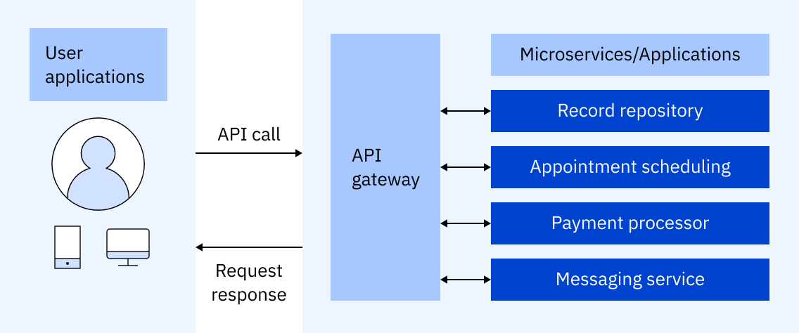

# API Gateway

## Definition

An **API Gateway** is a centralized server that sits between **clients (mobile apps, browsers, external systems)** and **backend services or microservices**.

It acts as a **single entry point** for all API requests, handling tasks such as:

* request routing
* authentication and authorization
* rate limiting
* load balancing
* logging and monitoring

Instead of clients calling multiple services directly, they call the API Gateway, which then forwards the request to the appropriate service.

---

## Why API Gateways Are Needed

In monolithic applications, clients interact with a single backend.
In microservices, dozens or hundreds of services exist.

Direct communication causes:

* multiple client-to-service network calls
* tight coupling between client and internal services
* complex authentication per service
* duplication of cross-cutting concerns
* difficulty in versioning and evolution

API Gateway solves these by:

* providing **one unified endpoint**
* hiding internal service structure from clients
* moving cross-cutting concerns to a single layer

This simplifies both **client logic** and **service design**.

---

## Key Responsibilities of an API Gateway

### Request Routing

Forwards client requests to appropriate backend service.

### Protocol Translation

Converts between:

* HTTP ↔ gRPC
* REST ↔ WebSockets
* JSON ↔ Protobuf

### Authentication and Authorization

Central place for:

* OAuth2 / JWT validation
* API keys
* Single Sign-On (SSO)

### Rate Limiting and Throttling

Prevents abuse by:

* limiting requests per user/IP/app
* protecting backend from overload

### Caching

Caches frequent responses to reduce latency.

### Load Balancing

Distributes traffic across multiple instances of a service.

### Request/Response Transformation

Modifies headers, parameters, or payloads when needed.

### Logging and Monitoring

Collects:

* metrics
* traces
* audit logs

for debugging and observability.

---

## How an API Gateway Works

1. Client sends a request to API Gateway

2. Gateway authenticates and validates the request

3. Gateway performs rate limiting or blocking if necessary

4. Gateway routes the request to the correct backend service

5. Service processes request and returns response to gateway

6. Gateway applies transformations, logging, or caching

7. Gateway sends response to client

This allows backend services to remain **hidden and protected**.

---

## Features Commonly Supported by API Gateways

* centralized authentication and security
* request aggregation (combine multiple service calls)
* service discovery integration
* versioning (`/v1`, `/v2` APIs)
* circuit breaker and retry logic
* SSL/TLS termination
* WebSocket support
* Canary and A/B deployments
* Geo-based routing

---

## API Gateway vs Reverse Proxy

| Aspect                                | API Gateway                               | Reverse Proxy              |
| ------------------------------------- | ----------------------------------------- | -------------------------- |
| Purpose                               | API management and cross-cutting concerns | Basic traffic forwarding   |
| Target                                | Microservices APIs                        | Web servers or app servers |
| Supports auth, rate-limit, versioning | Yes                                       | Usually limited            |
| Protocol handling                     | Often multiple protocols                  | Mostly HTTP/HTTPS          |
| Request transformation                | Yes                                       | Limited                    |

A reverse proxy mainly forwards traffic.
An API Gateway **adds policy, governance, and API management**.

---

## API Gateway vs Load Balancer

| Aspect         | API Gateway                 | Load Balancer                       |
| -------------- | --------------------------- | ----------------------------------- |
| Role           | Entry point for APIs        | Distributes traffic among instances |
| Layer          | Application layer (L7)      | L4 or L7                            |
| Focus          | API management and security | Traffic distribution                |
| Authentication | Yes                         | No                                  |
| Rate limiting  | Yes                         | No                                  |

In many architectures, **both are used together**:

* client → API Gateway → Load Balancer → service instances

---

## Advantages of Using an API Gateway

* single entry point for all APIs
* improves security by hiding internal services
* reduces client complexity
* supports multiple clients (web, mobile, IoT)
* centralized monitoring and logging
* enables microservice architecture
* handles cross-cutting concerns uniformly

---

## Challenges and Trade-offs

* adds a single point of failure if not highly available
* increases system complexity
* latency overhead because it is an additional hop
* misconfiguration can cause outages
* requires scaling and monitoring itself

---

## Patterns Implemented Using API Gateways

* Backend for Frontend (BFF)
* API composition / aggregation
* Edge routing
* Service mesh integration

---

## Popular API Gateway Technologies

* Nginx (with plugins)
* Kong API Gateway
* Amazon API Gateway
* Apigee
* Traefik
* Istio (service mesh gateway capability)
* Netflix Zuul
* Spring Cloud Gateway

---

## Summary

An API Gateway is a **centralized API entry point** in modern architectures, especially microservices. It manages:

* routing
* authentication
* rate limiting
* transformations
* monitoring
* protocol translation

It simplifies client interaction and strengthens security, but introduces its own overhead and must be designed carefully to avoid becoming a bottleneck or single point of failure.

---

