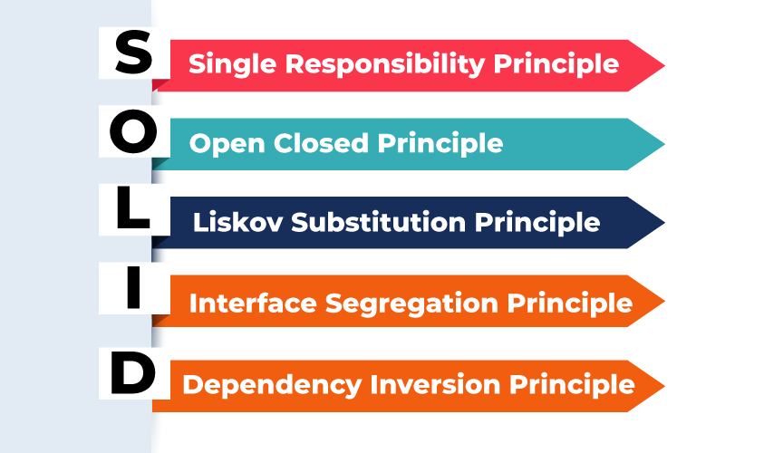

# SOLID Principles in Java

The SOLID principles are a set of design principles that help developers create maintainable,scalable, , testable, understandable, and flexible software. They are particularly useful in object-oriented programming.   



## What does SOLID stands for?

| Letter | Principle Name | Summary | 
|---------|------------|----------|
| S | Single Responsibility Principle | A class should have only one reason to change|
| O | Open/Closed Principle | Open for extension, closed for modification |
| L | Liskov Substitution Principle | Derived classes must be substitutable for base classes|
| I | Interface Segregation Principle | Clients shouldn't be forced to implement unused interfaces|
| D | Dependency Inversion Principle | Depend on abstractions, not concrete implementations |

---

## 1. Single Responsibility Principle (SRP)

**A class should have only one reason to change** which means every class should have a single responsibility or single job or single purpose.

- A chef cooks food, while a waiter serves it. Don’t ask a waiter to cook or a chef
to serve.

### Code Example (Violation of SRP)

```java
class Invoice {
    public void calculateTotal() { /* logic */ }
    public void printInvoice() { /* logic */ }
    public void saveToDB() { /* logic */ }
}
```

**This class does 3 things: business logic, output, and persistence — 3 reasons to change.**

### SRP Applied

```java
class Invoice {
    public void calculateTotal() { /* logic */ }
}
class InvoicePrinter {
    public void print(Invoice invoice) { /* logic */ }
}
class InvoiceRepository {
    public void save(Invoice invoice) { /* logic */ }
}
```

**Each class now has only one responsibility.**

### Where to apply? 

- Services doing too many unrelated tasks.

- Controllers bloated with UI + DB + business logic.


### Benefits:

- Easier to maintain, test, and extend.

- Encourages cleaner, modular design.

- One change doesn’t break unrelated things.

--- 

## 2. Open/Closed Principle (OCP)

**Software entities (classes, modules, functions, etc.) should be open for extension, but closed for modification** which means you should be able to extend a class behavior, without modifying it.

- A mobile phone lets you add apps, without changing its operating system code.

### Code Example ( Violating OCP):

```java
class NotificationService {
    public void send(String type, String message) {
        if (type.equals("email")) {
            // send email
        } else if (type.equals("sms")) {
            // send SMS
        }
    }
}
```
**Adding a new type (e.g., WhatsApp) requires modifying existing code.**

### OCP Applied – Using Polymorphism:

```java
interface Notification {
    void send(String message);
}

class EmailNotification implements Notification {
    public void send(String message) { /* send email */ }
}
class SMSNotification implements Notification {
    public void send(String message) { /* send SMS */ }
}
class NotificationService {
    public void sendNotification(Notification notification, String message) {
        notification.send(message);
    }
}
```

**To support WhatsApp, just create a new WhatsAppNotification class. No changes to existing code!**

### Where to Apply?

- Use when requirements frequently change.

- Use polymorphism and abstract classes/interfaces.

### Benefits:

- Encourages extensible, modular design.

- Minimizes regression bugs.

- Supports plug-and-play modules.

---
 
## 3. Liskov's Substitution Principle

**Derived or child classes must be substitutable for their base or parent classes.** This principle ensures that any class that is the child of a parent class should be usable in place of its parent without any unexpected behaviour.

- If a program uses a Bird, it should work with Sparrow or Parrot — but not with a Penguin if it can’t fly.

### Code Example ( Violating LSP):

```java
class Bird {
    void fly() { System.out.println("Flying"); }
}
class Ostrich extends Bird {
    void fly() { throw new UnsupportedOperationException(); }
}
```

**An Ostrich breaks LSP because it can't fly.**

### LSP Applied – Better Design:

```java
class Bird {
    void eat() {}
}
class FlyingBird extends Bird {
    void fly() {}
}
class Sparrow extends FlyingBird {}
class Ostrich extends Bird {}
```

**Now Ostrich doesn’t need to override fly().**

### Where to Apply?

- Be careful while overriding methods.

- Avoid violating superclass behavior or contracts.

### Benefits:

- Predictable and safe polymorphism.

- Promotes correct inheritance.

---

## 4. Interface Segregation Principle (ISP)

**Clients should not be forced to depend on interfaces they don’t use.** Your main goal is to focus on avoiding fat interface and give preference to many small client-specific interfaces. You should prefer many client interfaces rather than one general interface and each interface should have a specific responsibility.

- In a restaurant, a chef needs a Cook() interface, not Drive() or Fly().

### Code Example ( Violating ISP):

```java
interface Worker {
    void work();
    void eat();
}
class Robot implements Worker {
    public void work() { }
    public void eat() { throw new UnsupportedOperationException(); }
}
```
**Robot doesn’t eat, yet it's forced to implement eat().**

### ISP Applied:

```java
interface Workable {
    void work();
}
interface Eatable {
    void eat();
}
class Human implements Workable, Eatable {
    public void work() {}
    public void eat() {}
}
class Robot implements Workable {
    public void work() {}
}
```

**Each class implements only what it needs.**

### Where to Apply:

- Large interfaces with many unrelated methods.

- Prefer interface composition.

### Benefits:

- Better separation of concerns.

- More flexibility and fewer side effects.

- Easier testing and mocking.

---

## 5. Dependency Inversion Principle (DIP)

**High-level modules should not depend on low-level modules. Both should depend on abstractions.** Additionally, abstractions should not depend on details. Details should depend on abstractions.

- You use a charger with a standard socket – it doesn’t matter who manufactures it, as long as it fits the interface.

| Concept | Meaning|
|---------|------------|
|High-level module | Your core business logic |
|Low-level module | Utility, database, APIs, loggers, etc.|
|Abstraction | Interface or abstract class |
|Detail | Concrete implementation of the interface |

### What is Dependency Injection (DI)?

Dependency Injection is the act of injecting required objects (dependencies) from the outside rather than creating them inside the class.

### Code Example ( Violating DIP):

```java 
class MySQLDatabase {
    public void save(String data) { /* logic */ }
}
class UserService {
    MySQLDatabase db = new MySQLDatabase();
    public void saveUser(String data) {
        db.save(data);
    }
}
```

**UserService is tightly coupled to MySQLDatabase.**

### DIP Applied – Using Interface Injection:

```java
interface Database {
    void save(String data);
}
class MySQLDatabase implements Database {
    public void save(String data) { /* logic */ }
}
class UserService {
    private Database db;
    public UserService(Database db) {

        this.db = db;
    }
    public void saveUser(String data) {
        db.save(data);
    }
}
```

**Now UserService works with any database that implements Database.**

### Where to Apply:

- Any time you use new inside a class.

- Use constructor injection with interfaces.

### Benefits:

- Loose coupling.

- Highly testable (e.g., with mocks).

- Easier to swap implementations.